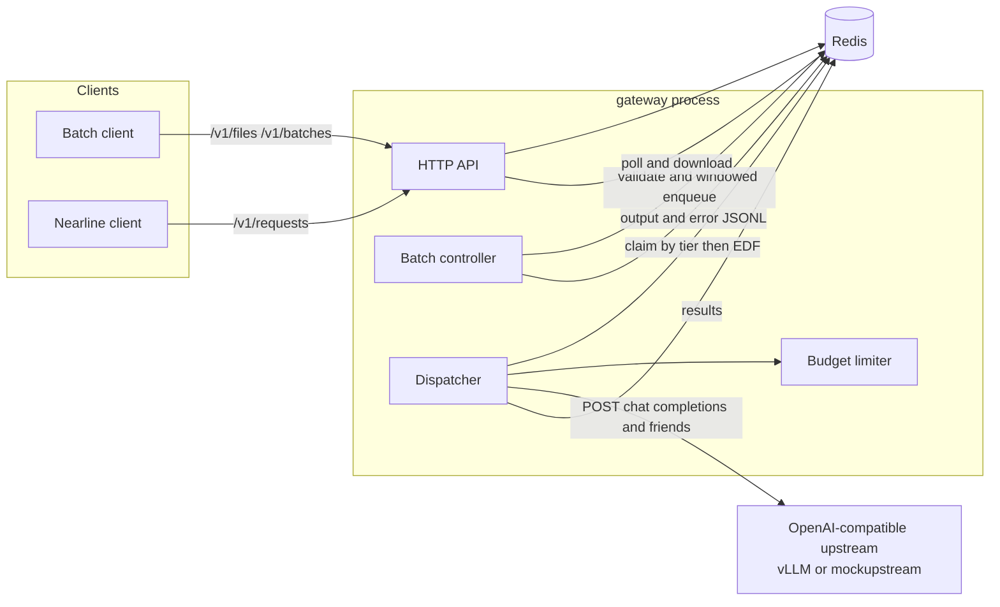
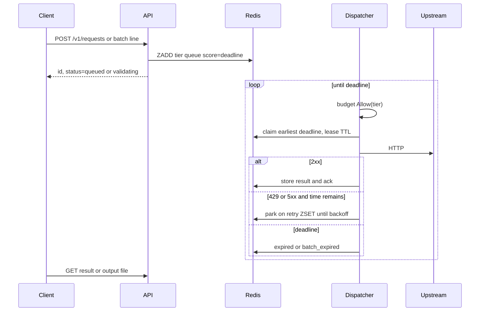

# llm-async-gateway

一个用 Go 和 Redis 实现的异步推理网关演示。它把两种入口接到同一条带截止时间的队列上：

1. **Batch**：兼容 OpenAI Batch API 的文件进、文件出作业。
2. **Nearline**：单次 OpenAI 风格请求异步提交，立刻返回 id，再轮询或取消。

调度思路对齐 [llm-d-async](https://github.com/llm-d/llm-d-async) 和 [llm-d-batch-gateway](https://github.com/llm-d/llm-d-batch-gateway)：Redis 有序集合按 deadline 做 EDF，claim/lease/ack 保证至少投递一次，派发前经过可替换的 budget。本仓库是可运行的第一版，不是生产级多租户系统。设计背景见仓库讨论中的调研笔记；下面描述的是**这份代码实际做成的样子**。

## 架构

API、批作业控制器和 dispatcher 跑在同一个 `gateway` 进程里，方便演示。它们只通过 Redis 协作，拆成多个副本时可以共用同一套键。



一条请求的生命周期：



### 队列

两个就绪队列，都是 Redis sorted set，score 是 deadline 的 Unix 毫秒，越小越先出队：

| 通道 | 键 | 谁写入 |
|---|---|---|
| nearline | `{prefix}:q:nearline` | `POST /v1/requests` |
| batch | `{prefix}:q:batch` | 批控制器按窗口补货 |

另外还有：

- `{prefix}:claimed`：已租出的请求，score 是租约到期时间。member 是 `id|owner`，owner 每次 claim 新生成，避免崩溃后的旧 worker 误 ack。
- `{prefix}:retry`：可重试失败在这里等到退避结束，再按**原来的 deadline** 回到就绪队列，不插队。
- `{prefix}:expired`：租约或退避期间已经过了 deadline 的 id，由 dispatcher 写成终态。

出队是 peek + claim + ack，不是 `ZPOPMIN`。租约默认 30s，每 `lease/3` 续期。dispatcher 崩溃后，过期租约会被重新入队，所以投递是 **at-least-once**。结果用 `SET NX` 只记第一次，批次数不会因为重复执行加两次。

### 优先级和防饥饿

Nearline 默认优先于 batch。两个例外：

1. **老化**：batch 队头的 deadline 已经落在 `AGING_SLACK` 内，并且比 nearline 队头更早，就先处理 batch。
2. **轮转份额**：连续派发 `BATCH_RESERVE_EVERY` 个 nearline 之后，如果 batch 队列非空，下一个名额给 batch。

并发闸门再留出 `RESERVED_BATCH_SLOTS` 个 in-flight 槽位，nearline 占用不到。这样高峰时 batch 不会因为 nearline 把并发打满而完全停住。

### Budget

`dispatch.Budget` 只有一个方法：

```go
Allow(ctx context.Context, tier model.Tier) (release func(), ok bool)
```

现在的实现是 `budget.Local`：全局令牌桶（速率）加上有上限的 in-flight，并遵守上面的预留槽位。以后可以换成 Prometheus 饱和度预算，例如 llm-d-async 的 `N = maxSYS * (D - baseline)`，dispatcher 不用改。

### 批作业

`POST /v1/batches` 立刻返回 `validating`。控制器流式解析 JSONL，任一非法行都会把整批打成 `failed` 并填上 `errors`。通过后进入 `in_progress`，但**不会一次把所有行推进 Redis 队列**。每个作业最多保持 `BATCH_ENQUEUE_WINDOW` 条未完成（排队 + 执行中）的请求，完成一条再补一条。多个作业按 deadline 从早到晚补货。

状态和 OpenAI 一致：`validating`、`in_progress`、`finalizing`、`completed`、`failed`、`expired`、`cancelling`、`cancelled`。成功行写入 `output_file_id`，失败、过期、取消的行写入 `error_file_id`，用 `custom_id` 对应，不保证顺序。`request_counts` 在执行过程中更新。上游 `usage` 会汇总进 batch 对象。

`completion_window` 用 Go duration（`30m`、`1h`、`24h`）。省略时默认 `24h`。OpenAI 目前只接受 `24h`；这里放宽，是为了能表达更短的近线小批。

取消会打上作业级标记。还没入队的行直接写成 `batch_cancelled`；已经入队的在 claim 时跳过；正在执行的请求在下一次租约心跳时中止上游调用。这比 OpenAI「最多再等约 10 分钟」更激进，演示里能更快收口。

窗口到期后停止补货。未执行的行写成 `batch_expired`。已经成功的行仍留在输出文件里，作业状态是 `expired`。

## 包布局

```
cmd/gateway          API + 控制器 + dispatcher
cmd/mockupstream     无 GPU 的 OpenAI 兼容上游
internal/api         /v1/files、/v1/batches、/v1/requests
internal/app         进程装配
internal/batch       校验、窗口入队、结果文件、状态机
internal/budget      并发/速率闸门（Budget 的一种实现）
internal/config      环境变量和 flags
internal/dispatch    租约、重试、上游 HTTP
internal/jsonl       Batch JSONL 解析
internal/model       对外 JSON 文档
internal/retry       退避和 Retry-After
internal/schedule    nearline / batch 选择
internal/store       Redis 存储和 Lua 脚本
internal/supply      模型供给规划（纯函数，不在请求路径上）
```

接口放在使用方：`dispatch.Budget` 和 `dispatch.Upstream`。存储是具体的 Redis 类型，测试用 miniredis，不另做一套假存储。

副本计划不走上面的队列。`internal/supply.Plan` 只根据需求和各 GPU 类型的预算算出目标副本数，不访问 Redis，也不改 Deployment。规则见 [docs/model-supply-planning.md](docs/model-supply-planning.md)。

## Nearline API

形态接近 OpenAI Responses 的 `background: true`（提交后拿 id，再轮询和取消），也接近 llm-d coordinator 的 `X-AP-Mode: enqueue`。没有复用 `/v1/responses` 的完整 schema，避免把同步 Responses 语义和异步作业缠在一起。

`POST /v1/requests` 返回 **202**：

```json
{
  "endpoint": "/v1/chat/completions",
  "deadline_seconds": 300,
  "metadata": {"tenant": "demo"},
  "body": {
    "model": "mock",
    "messages": [{"role": "user", "content": "hello"}]
  }
}
```

`endpoint` 可省略，默认 `/v1/chat/completions`。还支持 `/v1/completions`、`/v1/embeddings`、`/v1/responses`。`deadline_seconds` 可省略，默认 `DEFAULT_NEARLINE_DEADLINE`（5 分钟），范围 1 到 86400。`Idempotency-Key` 会返回同一个请求。

`GET /v1/requests/{id}` 返回同一份对象。`status` 为 `queued`、`in_progress`、`cancelling`、`completed`、`failed`、`expired`、`cancelled`。完成后 `response` 里是上游的 status code 和 body；失败时 `error.code` 类似 `deadline_exceeded`、`cancelled`、`upstream_error`、`max_attempts_exceeded`。

`POST /v1/requests/{id}/cancel` 对未结束的请求写入取消标记。已经结束的请求原样返回。

## 用 curl 试

先起依赖（二选一）：

```bash
docker compose up --build
# 网关 http://127.0.0.1:8080 ，mock http://127.0.0.1:8090
```

或者不用 Docker：

```bash
make demo
```

`scripts/demo.sh` 会拉起本机 Redis、mock 和 gateway，提交一条 nearline 和一份 batch，并打印结果。

### Nearline

```bash
curl -s -X POST http://127.0.0.1:8080/v1/requests \
  -H 'Content-Type: application/json' \
  -H 'Idempotency-Key: demo-nearline' \
  -d '{
    "endpoint": "/v1/chat/completions",
    "deadline_seconds": 60,
    "body": {
      "model": "mock",
      "messages": [{"role": "user", "content": "hello from nearline"}]
    }
  }'

curl -s http://127.0.0.1:8080/v1/requests/req_...
curl -s -X POST http://127.0.0.1:8080/v1/requests/req_.../cancel
```

### Batch

输入见 `examples/batch_input.jsonl`。每行必须有唯一的 `custom_id`、`method`（只能是 `POST`）、`url`、`body`。`url` 必须和创建 batch 时的 `endpoint` 一致。

```bash
curl -s -F purpose=batch -F file=@examples/batch_input.jsonl \
  http://127.0.0.1:8080/v1/files

curl -s -X POST http://127.0.0.1:8080/v1/batches \
  -H 'Content-Type: application/json' \
  -d '{
    "input_file_id": "file_...",
    "endpoint": "/v1/chat/completions",
    "completion_window": "24h",
    "metadata": {"job": "demo"}
  }'

curl -s http://127.0.0.1:8080/v1/batches/batch_...
curl -s 'http://127.0.0.1:8080/v1/batches?limit=20'
curl -s -X POST http://127.0.0.1:8080/v1/batches/batch_.../cancel
curl -s http://127.0.0.1:8080/v1/files/file_.../content
```

健康检查：`GET /healthz`，`GET /readyz`（会 ping Redis）。

## 配置

环境变量和同名 flag 都可以设。命令行覆盖环境变量。时间用 Go duration（`30s`、`24h`）。

| 环境变量 | Flag | 默认 | 含义 |
|---|---|---|---|
| `GATEWAY_ADDR` | `-addr` | `:8080` | 监听地址 |
| `REDIS_ADDR` | `-redis-addr` | `127.0.0.1:6379` | Redis |
| `REDIS_PASSWORD` | `-redis-password` | 空 | 密码 |
| `REDIS_DB` | `-redis-db` | `0` | DB |
| `KEY_PREFIX` | `-key-prefix` | `lag` | 键前缀 |
| `UPSTREAM_URL` | `-upstream-url` | `http://127.0.0.1:8090` | 推理上游 |
| `MAX_CONCURRENCY` | `-max-concurrency` | `8` | 最大 in-flight |
| `RESERVED_BATCH_SLOTS` | `-reserved-batch-slots` | `1` | 留给 batch 的槽位 |
| `RATE_LIMIT_RPS` | `-rate-limit-rps` | `50` | 准入速率 |
| `RATE_BURST` | `-rate-burst` | `16` | 令牌桶突发 |
| `LEASE_TTL` | `-lease-ttl` | `30s` | 可见性超时 |
| `POLL_INTERVAL` | `-poll-interval` | `50ms` | 调度轮询 |
| `REQUEST_TIMEOUT` | `-request-timeout` | `60s` | 单次上游超时 |
| `DEFAULT_COMPLETION_WINDOW` | `-default-completion-window` | `24h` | 省略时的批窗口 |
| `DEFAULT_NEARLINE_DEADLINE` | `-default-nearline-deadline` | `5m` | 省略时的近线截止 |
| `BATCH_ENQUEUE_WINDOW` | `-batch-enqueue-window` | `32` | 每批在队列中的上限 |
| `BATCH_RESERVE_EVERY` | `-batch-reserve-every` | `5` | 每 N 次 nearline 后让一次 batch；0 关闭 |
| `AGING_SLACK` | `-aging-slack` | `2m` | batch 进入老化的剩余时间 |
| `RESULT_TTL` | `-result-ttl` | `48h` | 结果键 TTL |
| `MAX_FILE_BYTES` | `-max-file-bytes` | `10485760` | 上传大小上限 |
| `RETRY_BASE` | `-retry-base` | `200ms` | 退避基数 |
| `RETRY_MAX` | `-retry-max` | `30s` | 退避上限 |
| `MAX_ATTEMPTS` | `-max-attempts` | `8` | 单请求尝试次数 |
| `LOG_LEVEL` | `-log-level` | `info` | `debug` `info` `warn` `error` |

重试对 408、429 和 5xx 以及网络错误生效。`Retry-After`（秒或 HTTP 日期）优先于指数退避，并且会被压到剩余 deadline 的一半以内。没有 `Retry-After` 时使用等量抖动。400 一类错误不重试。次数或时间耗尽后写入终态。

Mock 上游：

```bash
mockupstream -addr :8090 -delay 30ms
```

它实现 `POST /v1/chat/completions`、`/v1/responses`、`/v1/completions`、`/v1/embeddings`，在回复里带上固定的 `usage`，并把用户最后一句话回显成 `mock: ...`。

## 开发

需要 Go 1.22+。测试用 miniredis，不需要本机 Redis。Lint 用 [golangci-lint](https://golangci-lint.run) v1.61（与 `.golangci.yml` 和 CI 一致）。

```bash
make ci      # go vet, golangci-lint, go test -race
make build
make demo
```

## 设计取舍

- **一个执行面，两个入口。** 批作业和近线请求都变成带 `tier` 和 `deadline` 的 unit。API 分开，是为了贴住 OpenAI 的产品划分；队列共用，是为了让截止时间能跨入口比较。
- **Nearline 严格优先，再用老化和预留槽位保 batch。** 纯严格优先级会把 batch 饿到过期。纯 EDF 又会让一个快到期的大 batch 堵住交互式近线。现在的规则是：nearline 更早或一样早时 nearline 仍赢；只有 batch 更紧迫且已经进入 slack，才插到 nearline 前面。轮转和预留槽位保证即使 deadline 还早，batch 也有最低吞吐量。
- **窗口入队，而不是整文件一次 ZADD。** 大 batch 不会把全部 body 堆进就绪队列。代价是跨作业的 EDF 只在「已经入队的那一窗」里精确，更早的作业靠控制器按 deadline 排序优先补货来近似。
- **主动限流用本地并发和速率，而不是 Prometheus。** 演示没有 EPP / vLLM 指标。接口留成 `Budget`，避免以后接饱和度时改派发循环。本地预留槽位是「每层不同 baseline」的简化版。
- **至少一次，而不是正好一次。** 租约能把崩溃 worker 的请求找回来，也可能把同一次推理打两次。结果写入是幂等的；GPU 时间不是。这和 llm-d-async 的 durable dequeue 同一立场。
- **文件和作业元数据都在 Redis。** 少一个进程依赖。不适合 200MB / 5 万行的生产批量。

## 已知限制和下一步

- 没有鉴权、租户配额，也不剥客户端自带的优先级头。
- 文件字节存在 Redis 字符串里，没有 S3 生命周期，也没有 `output_expires_after`。
- 派发闸门不按 token 估算预算，只按请求数。长上下文会把闸门打歪。跨模型的副本计划在 `internal/supply`，不进这条请求路径。
- 单实例 Redis。Lua 里用字符串拼队列键，不能直接丢进 Redis Cluster。
- 结果键有 TTL。批输出文件本身不回收。
- 取消会中止正在进行的上游调用，而不是等 OpenAI 那种最长约 10 分钟的排空。
- `finalizing` 通常只存在很短一段时间；`finalizing_at` 会写上，轮询不一定能撞见这个状态。
- 窗口内的 EDF 是近似的。生产上更稳的做法是只入队 `job_id + offset`，派发前再读对象存储。
- 还没有 Prometheus 指标、OpenTelemetry、webhook，也没有 `X-Async-Mode: wait` 长连接。
- 重复推理没有计费去重之外的经济防护，只有 `MAX_ATTEMPTS` 和 deadline。

下一步如果继续做：对象存储加 checkpoint、Prometheus budget、按 token 加权、以及把 API 和 dispatcher 拆成可独立水平扩展的进程。
