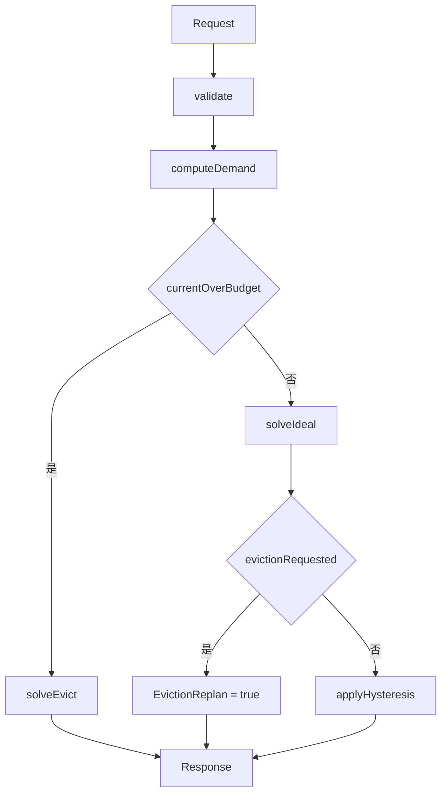

# 模型供给规划

本文是 `internal/supply.Plan` 的规格，按当前代码写，取代调研笔记 §5.3 的伪代码。网关 README 描述的是请求路径；这一页描述的是**副本计划**怎么算。两边不要混：派发闸门仍然按请求数限流，规划器不在那条路径上。

`Plan` 是纯函数。同一份 `Request` 多次调用，得到同一份 `Response`。它不读 Redis，不发 HTTP，不调用 Kubernetes。

## 1. 背景和目标

异步网关把 nearline 和 batch 收进带 deadline 的队列，dispatcher 再按 tier 和 EDF 把请求打到已经存在的上游。队列能把请求攒住，但不能变出 GPU。模型供给规划回答的是另一件事：在这一拍的 GPU 预算下，每个模型在每种 GPU 上应该有多少个副本。

三方的分工：

| 角色 | 谁做 | 在这个仓库里 |
|---|---|---|
| 网关 | 接请求、按 deadline 排队、租约派发、按请求数限流 | `internal/api`、`internal/store`、`internal/dispatch`、`internal/budget` |
| 规划器 | 读需求和 `B_g`，写出目标副本数 | `internal/supply` |
| 执行面 / 放置 | 把目标副本数变成进程或 Pod，并选节点 | 不在本仓库，规划器不调用它们 |

调用方自己准备输入：从队列扫出积压直方图，从剖面读出每种 GPU 的吞吐和冷启动，从平台读出驱逐之后还剩多少卡。`Plan` 返回计划。执行面下一拍把实际 ready / warming 填回 `Supply`，形成闭环。规划器不保存上一拍的 EWMA，也不记得上次计划；这两样都由调用方放进请求。

目标就四条：

1. 需求用 token/s，并且跟剖面的 μ 同一单位。
2. 赶不上冷启动的积压不要把副本数打到无穷，也不要占预算。
3. 同一 tier 里，能在 deadline 前排完的模型整笔给够；不要把预算切碎，让所有模型一起错过。
4. 预算突然变小时立刻缩，并且尽量保住预留。

### 不做什么

- 不改 Deployment，不调度 Pod，不抢占，不绑核。
- 不实现异构 MILP / Mélange。一个模型可以落在多种 GPU 上，但那是下面这条贪心快速路径，不是全局最优指派。
- 不把到达率和泄洪率捆在一起做 EWMA。泄洪每个 tick 用当前直方图重算。
- 不把本拍新加的副本当成已经在服务。冷启动结束之前，它只出现在 `WarmingTokensPerSec`。
- 不扫描网关队列，也不替换 `budget.Local`。

### 和旧 §5.3 的差别

旧伪代码如果按原文实现，会把供给算错。代码有意避开这些写法。

| 旧写法 | 实际后果 | 代码现在 |
|---|---|---|
| `Q / max(T - cold, ε)`，整条队列一个 deadline | `T ≤ cold` 时分母变成 ε，需求趋向无穷 | `computeDemand`：只有 `T > cold_min` 的桶进入泄洪率 |
| 到达率和泄洪一起 EWMA | 泄洪被历史值拖住 | 只有到达率看 `EWMAAlpha` |
| `R = min over g of gpu_need[g]` | 选了更慢的类型之后副本不够 | 需求一直是 tok/s，选定类型之后再加副本 |
| 每个 GPU 类型各留一份 `ReservedMinGPUs` | 预留被乘以类型数 | `ensureReserved` 用模型已经占用的 GPU 数扣减 |
| 一加上副本就更新 φ，并给所有模型各分一点 | 冷启动还没结束就算就绪；两个都能救的模型被拆开后一起错过 | `deadlinesMet` 用时间积分；`triage` 整笔资助 |
| cooldown 也套在预算收缩上 | 驱逐之后还要等冷却 | footprint 超预算走 `solveEvict`，不看冷却 |

## 2. 术语和符号

时间在公式里用秒。代码里对外是 `time.Duration`，内部用 `Seconds()`。吞吐是 token/s，不是请求/s。GPU 数是整数。

| 符号 | 代码 | 单位 | 含义 |
|---|---|---|---|
| `B_g` | `GPUBudget.GPUs` | GPU | 类型 `g` 这一拍还能给规划器的卡数。调用方已经扣掉别的占用 |
| `u[m,g]` | `Profile.GPUsPerReplica` | GPU / 副本 | 模型 `m` 在类型 `g` 上一个副本占几张卡。必须 ≥ 1 |
| `μ[m,g]` | `Profile.MuTokensPerSec`，或请求速率 × 平均 token | token/s / 副本 | 该形状下，一个副本持续生成 token 的速率 |
| `cold[m,g]` | `Profile.ColdStart` | 秒 | 从 0 启动一个新副本到它开始产出的时间 |
| `cold_min` | `mstate.minCold` | 秒 | 该模型**可行**类型里最短的冷启动 |
| `T` | `Bucket.Remaining` | 秒 | 这一档积压距离 deadline 还剩多久 |
| `Q` | `Bucket.Tokens`，或 `Requests × (AvgInput+AvgOutput)` | token | 这一档的 token 质量，输入加输出 |
| `λ` | 平滑后的到达率 | token/s | 见 §4.1。不是请求/s |
| `D_m` | `ModelPlan.DemandTokensPerSec` | token/s | 截断之后的有效需求 |
| `x[m,g]` | `ReplicaCount.Replicas` | 副本 | 目标副本数 |
| `H` | `Request.Horizon`，或模型自己的视界 | 秒 | 计算 φ 时看的时刻 |
| `φ_m` | `ModelPlan.Phi` | 无量纲 | `rate(H) / D_m`。`D_m` 约为 0 时响应里写 0 |
| tier | `Model.Tier` | 整数 | 越小越优先。0 高于 1。代码不把 0/1/2 写成 nearline/batch |
| weight | `Model.Weight` | 无量纲 | 同 tier 内的权重。≤ 0 时内部按 1，不报错 |
| reserved | `ReservedMinGPUs` | GPU | 这个模型希望至少占住的卡数，**跨类型合计** |
| floor | `reservedFloors` | GPU | 空分配上 `ensureReserved` 实际放下的卡数，可以因向上取整大于 reserved |
| ready | `GPUSupply.Ready` | 副本 | 现在已经在产出的副本 |
| warming | `GPUSupply.Warming` | 副本 + ETA | 已经启动但还没就绪的批次，ETA 是剩余时间 |
| ε | `Request.Epsilon` | 秒 | 泄洪窗口的下限。0 或负数都变成 1ms |
| `tokenTol` | 常量 `1e-6` | 相对误差 | `enough` 和 φ 比较用的容差，不是请求字段 |

可行类型：剖面没有把 `Infeasible` 设为真，并且 μ > 0。μ 为 0 的类型留在 `byType` 里（供给若落在上面，仍按 `u` 占预算），但不会被选去新增副本。

## 3. 输入和输出

调用形式：

```go
resp, err := supply.Plan(req)
```

这是 Go 结构体，不是 HTTP schema。下面的 JSON 是 `encoding/json` 对这些结构体的默认编码，用来把每个字段摊开。除了 `GPUBudget` 和 `ReplicaCount`，字段都没有 json tag，所以名字就是导出名。`time.Duration` 编成纳秒整数，`time.Time` 编成 RFC 3339。零值也会出现，因为没有 `omitempty`。业务代码应直接填结构体。

### 3.1 `Request`

| 字段 | 单位 | 默认 / 校验 |
|---|---|---|
| `Now` | 时刻 | 零值表示「没有当前时间」。冷却判断会因此不成立 |
| `Epsilon` | 纳秒，语义是秒 | `<= 0` 时用 1ms。不单独报错 |
| `Horizon` | 纳秒，语义是秒 | `<= 0` 时每个模型用自己的视界：可行类型冷启动和已有 warming ETA 的最大值 |
| `Eviction` | 布尔 | true 时，若 footprint 还没超预算，跳过冷却和步长，直接返回理想计划，并置 `EvictionReplan` |
| `PreviousBudgetGPUs` | GPU | 负数报错 `supply: previous budget is negative`。大于 0 且 **严格大于** 新预算总和时，与 `Eviction` 相同。等于总和不算收缩。0 表示不提供 |
| `Budgets` | 见下 | 类型名空：`supply: budget is missing a GPU type`。GPU 负数：`supply: budget for %s is negative`。类型重复：`supply: duplicate budget for %s` |
| `Models` | 见下 | 可以是空列表，这时计划也是空的 |

`GPUBudget`：`Type` 字符串，`GPUs` 是该类型的 `B_g`。JSON 名是 `type`、`gpus`。

没出现在 `Budgets` 里的 GPU 类型，预算按 0。往上放副本会失败。

### 3.2 `Model`

| 字段 | 单位 | 默认 / 校验 |
|---|---|---|
| `ID` | 字符串 | 空：`supply: model is missing an id`。重复：`supply: duplicate model %s` |
| `Tier` | 整数 | 不校验范围。可以是负数，负数比 0 更优先 |
| `Weight` | 无量纲 | `<= 0` 时内部改成 1，不报错，响应里也不回写 |
| `ReservedMinGPUs` | GPU | 负数报错。0 表示没有预留 |
| `SoftMaxGPUs` | GPU | 负数：不截断需求，放置也不受软顶限制。0：**这个模型一张卡都不能占**，需求被截成 0。正数：截断并限制放置。没有第三种「忘了填就当无限」 |
| `ArrivalTokensPerSec` | token/s | 负数报错。大于 0 时优先于请求速率，两者不叠加 |
| `ArrivalRequestsPerSec` | 请求/s | 仅当前者是 0 时使用，乘以平均输入加输出 token。没有平均数则 `supply: model %s arrival is in requests but has no average tokens` |
| `ArrivalEWMA` | token/s | 上一拍平滑值。负数报错。只有 `EWMAAlpha > 0` 才参与 |
| `EWMAAlpha` | 无量纲 | 必须在 `[0, 1]`，否则 `supply: model %s EWMA alpha must be in [0, 1]`。0 表示不平滑 |
| `EngineTokensPerSec` | token/s | 可选。大于 0 时优先于引擎请求速率 |
| `EngineRequestsPerSec` | 请求/s | 换算规则同到达率，缺平均数时报错 |
| `AvgInputTokens`、`AvgOutputTokens` | token / 请求 | 负数报错。只用两者之和 |
| `Backlog` | 桶的列表 | 顺序无关。代码按 `Remaining` 再按名字排序 |
| `Supply` | 按 GPU 类型 | 同一类型出现多次会相加。类型名空、ready 为负、warming 数量或 ETA 为负都会报错 |
| `Profiles` | 按 GPU 类型 | 类型名空、类型重复、`GPUsPerReplica <= 0`、μ 或冷启动为负都会报错 |
| `LastPlanChange` | 时刻 | 零值表示没有上次变更，冷却不生效 |
| `Cooldown` | 纳秒 | `<= 0` 表示没有冷却 |
| `MaxStep` | 副本 | 负数报错。0 表示普通 tick 不限步长，直接采用理想副本数 |

`Bucket`：`Name` 可空，空则错误信息里用 `Remaining` 的字符串。`Remaining` 为负报错。`Tokens` 和 `Requests` 为负报错。`Tokens > 0` 时忽略 `Requests`。两者都是 0 的桶跳过。只有请求数、且平均 token 是 0：`supply: model %s bucket %s counts requests but has no average tokens`。

`GPUSupply`：`Ready` 是副本数。`Warming` 是若干批，每批 `Count` 和 `ETA`。同一类型的 warming 按 ETA 从短到长使用。

`Profile`：`Infeasible == true` 或算出来的 μ 为 0 时，该类型不能新增副本。若同时填了 `MuTokensPerSec` 和 `MuRequestsPerSec`，用 token 速率。请求速率只在 token 速率是 0、且平均 token 大于 0 时换成 `MuRequestsPerSec * (AvgInput+AvgOutput)`。

到达率有一个容易看错的点：`ArrivalTokensPerSec == 0` 且没有请求速率时，本拍观测就是 0，不是「缺测」。`EWMAAlpha > 0` 仍会把它和 `ArrivalEWMA` 混合。已经平滑好的速率应放在 `ArrivalTokensPerSec`，并把 alpha 留 0。

### 3.3 `Response`

| 字段 | 单位 | 含义 |
|---|---|---|
| `Models` | 与请求相同的顺序 | 每个模型一份 `ModelPlan` |
| `BudgetUsed` | GPU | 每个预算类型的实际占用，外加计划里用到、但预算表没有的类型。按类型名字母序。占用 0 的预算类型也在 |
| `EvictionReplan` | 布尔 | 走了 `solveEvict`，或 `Eviction` / 上一拍预算变小，或滞后合并之后又超预算并被 `fit` 裁过 |

`ModelPlan`：

| 字段 | 单位 | 含义 |
|---|---|---|
| `ModelID` | | 请求里的 `ID` |
| `TargetReplicas` | 副本 | 只列出副本数大于 0 的类型，按类型名排序。没有副本时是 nil，JSON 里是 `null`，不是 `[]`。用 `Replicas(type)` 读取，缺席类型返回 0 |
| `TargetGPUs` | GPU | `sum x[g] * u[g]`，含向上取整多出来的卡 |
| `DemandTokensPerSec` | token/s | 截断后的 `D_m` |
| `SmoothedArrivalTokensPerSec` | token/s | 平滑后的到达率，不含泄洪 |
| `DrainTokensPerSec` | token/s | 可满足桶的泄洪率之和，没有 EWMA |
| `ReadyTokensPerSec` | token/s | 计划保留的、ETA 约为 0 的副本的 μ 之和 |
| `WarmingTokensPerSec` | token/s | 计划保留的 warming，加上本拍新副本。冷启动为 0 的新副本 ETA 是 0，会计入 ready 而不是这里 |
| `UnsatisfiableTokens` | token | `T ≤ cold_min` 或没有可行类型的桶的 `Q` 之和。整档计入，不扣掉 ready 也许能服务的部分 |
| `Phi` | 无量纲 | `D_m <= 1e-6` 时为 0，否则 `rate(H) / D_m` |
| `ReservedDeficitGPUs` | GPU | `max(0, ReservedMinGPUs - TargetGPUs)`。向上取整时是 0 |
| `Notes` | 字符串 | 去重，按第一次写下的顺序。没有任何注释时是空切片，JSON 是 `[]` |

`Notes` 里会出现的值：

| 值 | 谁写下 |
|---|---|
| `unsatisfiable_backlog` | `computeDemand`，不可满足 token 大于 0 |
| `clamped_soft_max` | `clamp`，截断确实把 `D_m` 降低了 |
| `reserved` | `ensureReserved`，只要 `ReservedMinGPUs > 0`，不论最后是否放满 |
| `reserved_deficit` | 预留没放满。`ensureReserved` 或 `plan` 都会补这句 |
| `reserved_rounded_up` | 放下的 GPU 数严格大于 `ReservedMinGPUs` |
| `triage` | `fund` 成功，为泄洪加过副本 |
| `triage_unsavable` | 该 tier 的 triage 结束时，仍有可满足桶没排完 |
| `fairness` | 公平性阶段加过至少一个副本 |
| `deadline_bypass` | `applyHysteresis` 发现当前 footprint 排不完可满足桶，改用理想计划 |
| `cooldown_hold` | 冷却期内保持当前副本 |
| `step_clamped` | `MaxStep > 0` 且这一拍没有走到理想副本数 |

冷却或步长挡住变更时，响应保留需求阶段的注释（不可满足、截断），不复制理想计划里的 `triage` / `fairness`。步长刚好走到理想计划时，注释改成理想计划的注释。

### 3.4 一份真实的 JSON

下面这份请求同时带了 EWMA、两档直方图、ready 和 warming、两种 GPU。`Plan` 的输出就是后面的响应，不是手写的。

请求里几个纳秒值：`Remaining` 20s = `20000000000`，5min = `300000000000`，冷启动 30s = `30000000000`、45s = `45000000000`，warming ETA 15s = `15000000000`。`LastPlanChange` 的零值会编成 `0001-01-01T00:00:00Z`。

```json
{
  "Now": "2023-11-14T22:13:20Z",
  "Epsilon": 0,
  "Horizon": 0,
  "Eviction": false,
  "PreviousBudgetGPUs": 0,
  "Budgets": [
    { "type": "H100", "gpus": 4 },
    { "type": "A100", "gpus": 2 }
  ],
  "Models": [
    {
      "ID": "model-a",
      "Tier": 0,
      "Weight": 2,
      "ReservedMinGPUs": 1,
      "SoftMaxGPUs": 4,
      "ArrivalTokensPerSec": 10,
      "ArrivalEWMA": 30,
      "EWMAAlpha": 0.5,
      "AvgInputTokens": 512,
      "AvgOutputTokens": 128,
      "Backlog": [
        { "Name": "30s", "Remaining": 20000000000, "Tokens": 5000, "Requests": 0 },
        { "Name": "5m", "Remaining": 300000000000, "Tokens": 12000, "Requests": 0 }
      ],
      "Supply": [
        { "Type": "H100", "Ready": 1, "Warming": [{ "Count": 1, "ETA": 15000000000 }] }
      ],
      "Profiles": [
        { "Type": "H100", "GPUsPerReplica": 1, "MuTokensPerSec": 100, "ColdStart": 30000000000, "Infeasible": false },
        { "Type": "A100", "GPUsPerReplica": 1, "MuTokensPerSec": 40, "ColdStart": 45000000000, "Infeasible": false }
      ],
      "LastPlanChange": "0001-01-01T00:00:00Z",
      "Cooldown": 0,
      "MaxStep": 0
    }
  ]
}
```

零值字段在真正的 `Marshal` 输出里都在，上面为了阅读略去了仍是 0 的速率字段。语义和完整编码相同。

这一拍的中间量：

- 平均 token 是 512+128 = 640。本例桶上已经是 token，用不到这个数。
- `cold_min = min(30s, 45s) = 30s`。30s 桶的 `T = 20 ≤ 30`，5000 token 全部不可满足，泄洪率 0。
- 5 分钟桶：`T = 300 > 30`，窗口 270s，泄洪率 `12000 / 270 = 400/9 ≈ 44.444 token/s`。
- 到达率 `0.5*10 + 0.5*30 = 20`。没有引擎信号。`D = max(20, 44.444, 0) = 44.444`。
- 最快类型是 H100（μ 100 > 40）。软顶 4 张卡、`u = 1`，上限 400 token/s，不截断。
- 预留 1 张卡。H100 上还有没被分配吃掉的 ready，`betterPlace` 先占它。目标是 1 个 H100 副本，而且就是那个 ready 副本。观察到的 warming 不在目标里，所以 `WarmingTokensPerSec = 0`，`ReadyTokensPerSec = 100`。
- 这一个 ready 副本在 300s 内产出 `100 * 300 = 30000 ≥ 12000`，可满足桶已经排完。公平性看到 `rate(H) = 100 ≥ D`，不再加副本。`H` 取最长冷启动 45s。`φ = 100 / (400/9) = 2.25`。
- A100 预算 2 没有用到，`BudgetUsed` 仍列出它，且按字母序排在 H100 前面。

```json
{
  "Models": [
    {
      "ModelID": "model-a",
      "TargetReplicas": [{ "type": "H100", "replicas": 1 }],
      "TargetGPUs": 1,
      "DemandTokensPerSec": 44.44444444444444,
      "SmoothedArrivalTokensPerSec": 20,
      "DrainTokensPerSec": 44.44444444444444,
      "ReadyTokensPerSec": 100,
      "WarmingTokensPerSec": 0,
      "UnsatisfiableTokens": 5000,
      "Phi": 2.25,
      "ReservedDeficitGPUs": 0,
      "Notes": ["unsatisfiable_backlog", "reserved"]
    }
  ],
  "BudgetUsed": [
    { "type": "A100", "gpus": 0 },
    { "type": "H100", "gpus": 1 }
  ],
  "EvictionReplan": false
}
```

软顶和 H100 预算都是 4，计划只用了 1。`BudgetUsed` 是占用，不是预算。

## 4. 算法

总入口是 `Plan`。三条路互斥。



```text
function Plan(req):
  validate(req)                          # 失败则返回 error，没有部分计划
  if currentOverBudget():                # 当前 ready+warming 的卡数已经超过某个 B_g
    w.evict = true
    solveEvict()                         # 从当前副本往下砍，不看冷却和步长
    return response()
  ideal = solveIdeal()                   # 从空分配做预留、triage、公平性
  if evictionRequested():                # Eviction，或上一拍总预算严格大于现在
    ideal.evict = true
    return ideal.response()              # footprint 还放得下，直接采用理想计划
  applyHysteresis(ideal)                 # 普通 tick：冷却、步长，或 deadline 绕过
  return response()
```

`currentOverBudget` 比 `evictionRequested` 先判断。两者都成立时走 `solveEvict`，因为当前副本已经不合法，不能先发表一份从零算起、却假装冷却还在的计划。

### 4.1 需求：`computeDemand`

对每个模型独立计算，不看别的模型，也不看预算。桶与桶之间没有「一个 deadline 代表全队列」。

**Token 质量。** `bucketTokens`：`Tokens > 0` 用它；否则 `Requests * (AvgInputTokens + AvgOutputTokens)`。

**冷启动门槛。** `cold_min` 是可行类型冷启动的最小值。没有可行类型时，所有正质量的桶都不可满足。

对每个 `Q > 0` 的桶：

```text
if 没有可行类型 or T <= cold_min:
  unsatisfiable += Q          # 泄洪率加 0，禁止除以 ε
else:
  window = T - cold_min
  if window < ε: window = ε  # ε 默认 0.001s；只作用于已经跨过门槛的桶
  drain += Q / window
```

`T = cold_min` 同样不可满足，比较是严格大于。旧公式 `max(T - cold, ε)` 在 `T = 20`、`cold = 45`、`ε = 0.001` 时会得到 `Q / 0.001`。这里得到 0。

多档泄洪率相加。这个和是峰值信号，不按时间重叠去重。一个很短的可满足桶和一个很长的桶会把两个速率叠在 `D_m` 里。排得完排不完另由 §4.4 的时间积分判断，那一步按累计 token，不把两个速率再加一次。

**到达率。**

```text
raw = ArrivalTokensPerSec                      # > 0
    或 ArrivalRequestsPerSec * avgTok          # 否则，且请求速率 > 0
    或 0
smoothed = raw
if EWMAAlpha > 0:
  smoothed = EWMAAlpha * raw + (1 - EWMAAlpha) * ArrivalEWMA
```

泄洪不进入这个式子，也没有「上一拍泄洪」字段。

**引擎侧。** 与到达率同一套优先级：token 速率优先，否则请求速率乘平均 token，否则 0。

```text
D = max(smoothed, drain, engine)
D = clamp(D)
```

**软顶截断 `clamp`。** `SoftMaxGPUs < 0` 时原样返回。否则在可行类型里选最快的：μ 更大者优先；μ 相同则 μ/u 更大者优先；再相同则类型名更小者优先。

```text
n_cap = floor(SoftMaxGPUs / u_fastest)    # 整数除法
cap   = n_cap * μ_fastest
if D > cap: 记下 clamped_soft_max，D = cap
```

软顶为 0，或小于 `u_fastest`，则 `cap = 0`。正的需求会被截成 0。截断发生在预留和 triage 之前，所以一条 `1e9` 的到达率不能在后面的公平性里把集群占满。软顶同时是放置约束：`canFit` 拒绝使 `已用 GPU + u > SoftMaxGPUs` 的副本（软顶为负则不检查）。

### 4.2 一个副本何时产出

计划里的 `x[g]` 要对照观察到的供给，才能知道每个副本的 ETA。`timedReplicas` 对每个类型：

```text
ready_kept = min(x[g], Ready[g])          # ETA = 0
剩下的名额按 ETA 从短到长吃掉 Warming 批次
再剩下的是新副本，ETA = cold[g]
```

μ 为 0 的类型不产生 timed replica，但 `gpusUsed` 仍把它们的 `u` 算进占用。

时刻 `T` 之前的产量（`produced`）：

```text
sum over replicas:  if T > ETA: μ * (T - ETA) else 0
```

这是积分，不是 `μ * T`。新副本在冷启动结束前产量是 0。`T = ETA` 也是 0。

`rate(H)` 是另一件事：ETA `≤ H + 1e-6` 的副本，把整个 μ 加进去。它表示「到了时刻 H，速率是多少」，不是窗口内的 token 总量。

默认 `H`（`horizon`）：请求里的 `Horizon > 0` 时所有模型共用它；否则取该模型可行冷启动和已有 warming ETA 的最大值。因此在默认视界上，本拍新副本的冷启动刚好结束，会计入 φ，但仍不会计入 `ReadyTokensPerSec`，除非冷启动本身是 0。

`ReadyTokensPerSec` 只加 ETA `≤ 1e-6` 的副本。其余计入 `WarmingTokensPerSec`。

### 4.3 类型怎么选

`canFit` 要求同时满足：μ > 0，`u > 0`，该类型剩余预算 `≥ u`，以及软顶还放得下这 `u` 张卡。

`betterPlace` 用于预留和驱逐时的搬家，排序是：

1. 该类型上还有没被当前分配吃掉的 ready（`Ready - x > 0`）。只看有没有，不看有几个。
2. 否则，还有没吃掉的 warming。
3. 然后 μ/u 高的优先。
4. 然后 μ 高的优先。
5. 类型名小的优先。

所以「已经在跑的慢卡」会胜过「还要冷启动的快卡」。两边都有 ready，或都没有，才比吞吐。

`pickTriageType` 看的是最早一个还没排完的 deadline `T`（`earliestUnmet`）。候选类型必须 `canFit`，并且这一份副本在 `T` 之前的边际 token 大于 0：

```text
若还有空闲 ready:     边际 = μ * T
否则若下一份 warming 的 ETA < T:  边际 = μ * (T - ETA)
否则若 cold < T:      边际 = μ * (T - cold)
否则                  边际 = 0，这个类型不能选
```

得分是边际 token 除以 `u`。取得分最高者，平手取类型名较小者。

`pickFairType` 不看积压。它要求 `etaIfAdded ≤ H`。`etaIfAdded` 与上面的边际相同：空闲 ready 的 ETA 是 0，否则是下一份 warming 的 ETA，否则是冷启动。得分是 μ/u，平手取类型名。视界若被调用方设得很短，冷启动来不及在 `H` 之前结束的类型不会被公平性选中，φ 也不会因为加上它而提高。

副本数没有先做成「所有类型 GPU 需求的最小值」。`TestUnboundedDemandUsesChosenType` 的数是：H100 预算 0、μ = 100，A100 预算够、μ = 20，到达率 100 token/s。若取 min GPU，H100 只要 1 张卡，A100 要 5 张，错误结果是 1。代码只能放在 A100 上，公平性加到 `rate = 100`，也就是 5 个副本。

从零开始、单一类型、没有 ready 时，公平性加到 `rate(H) ≥ D` 的副本数等于 `ceil(D / μ)`。已有 ready 时不一定等于这个数：ready 覆盖整个窗口，泄洪率公式却假设产能在 `cold_min` 之后才出现，所以 `D` 可能高于「再买几个新副本才够」的速率。triage 以时间积分为准，不会按 `ceil(D/μ)` 把 ready 再买一遍。

### 4.4 理想计划：`solveIdeal`

从空的 `x` 开始。当前 ready / warming 只影响 ETA 和类型选择，不会自动占住预算。普通 tick 若没有冷却和步长，目标可以一下子低于当前副本数。

```text
function solveIdeal():
  ensureReserved()
  for tier in tiers 升序:          # 0，然后 1，然后 2...
    triage(tier)
    fairness(tier)
```

高 tier 的公平性在低 tier 的 triage **之前**。高 tier 会先把 φ 补到不少于 1，低 tier 只能用剩下的卡去救 deadline。低 tier 的预留不受影响，因为预留在循环之前已经占住。`TestHighTierFairnessPrecedesLowerTierTriage` 锁的就是这件事。

#### 预留 `ensureReserved`

模型顺序 `byPriority`：tier 升序，weight 降序，最早可满足 deadline 升序，最后 `ID` 升序。没有可满足桶的模型，最早 deadline 视为正无穷，排在有 deadline 的模型后面。

```text
for m in byPriority():
  if ReservedMinGPUs <= 0: continue
  note("reserved")
  while gpusUsed(m) < ReservedMinGPUs:
    g = pickReservedType(m)       # betterPlace + canFit
    if 放不下: break
    x[m,g] += 1
  if gpusUsed < ReservedMinGPUs: note("reserved_deficit")
  if gpusUsed > ReservedMinGPUs: note("reserved_rounded_up")
```

已经占用的 GPU 计入 `gpusUsed`，所以同一次调用不会在第二种类型上把预留再留一遍。`u` 不能整除时，循环仍是「一次加一整副本」。加完若超过预留，循环停止，多出来的卡留下，并注明向上取整。下一副本放不下时停止，差额是 `ReservedMinGPUs - gpusUsed`，响应写在 `ReservedDeficitGPUs`。

数：预留 3 GPU，`u = 2`，预算 4。第一副本用 2 张，仍小于 3；第二副本再用 2 张，共 4，停止。没有缺口。预算只有 2 时，只能放 1 个副本，缺口 1。`TestReservedRoundsUpOrReportsDeficit`。

两个 tier 各要 3 GPU，预算 4，`u = 1`：高 tier 拿 3，低 tier 拿 1，低 tier 缺口 2。高 tier 先走。

#### Triage

只处理当前 tier。一个模型「排完了」当且仅当 `deadlinesMet`：把可满足桶按 `T` 再按名字排序，要求对每个前缀，

```text
produced(T_k) >= Q_1 + ... + Q_k
```

比较经过 `enough`：缺口不超过 `1e-6 * max(1, |需要的 token|)` 也算够。不可满足桶不在这个和里，也不会先把 ready 的产量扣给它们。这是计划侧的近似：真实服务若先做那档来不及的活，可满足桶会更紧。代码不建这个扣减。

没有可满足桶时，`deadlinesMet` 为真。这样的模型不进 triage 的资助循环，但若 `D > 0` 会参加公平性。

```text
function triage(tier):
  blocked = {}
  loop:
    saveable = []
    for m in 该 tier 且不在 blocked 且还没 deadlinesMet:
      if canSave(m): saveable.append(m)
      else: blocked.add(m)
    if saveable 为空: break
    按最早可满足 T、然后 weight 降序、然后 ID 排序
    best = saveable[0]
    if fund(best) 失败: blocked.add(best); continue
    note(best, "triage")
  for m in 该 tier:
    if 有可满足桶且仍未排完: note("triage_unsavable")

function canSave(m):
  记下所有模型的 x，结束时恢复          # 不改预算的真实占用
  if deadlinesMet(m): return true
  repeat 至多 stepLimit 次:
    g = pickTriageType(m)
    if 没有: return false
    x[m,g] += 1
    if deadlinesMet(m): return true
  return false

function fund(m):                         # 与 canSave 同一套选择，但留下副本
  同样的循环，成功则返回 true
```

`canSave` 用的是**这一刻还没分出去**的全部剩余预算，不是这个模型的公平份额。它回答「把剩下的都给它，能不能排完」。不能，则除了已经落下的预留，不再给副本。能，则 `fund` 加到刚刚排完为止，不是加到把预算用光。

资助顺序只在「当前仍能救」的模型之间比：deadline 更紧优先，其次权重大，再按 ID。救下一个之前会重算谁还能救，因为预算已经少了。权重不会压过更紧的 deadline。

`stepLimit = max(64, 1 + sum_g B_g)`。这是安全上限，不是调参。正常预算下，副本数不会碰到它。

#### 公平性 `fairness`

发生在**这个 tier 的 triage 之后**。没排完的模型直接跳过，所以 `triage_unsavable` 的模型不会在公平性里把卡要回去。

```text
function fairness(tier):
  repeat 至多 stepLimit * 模型数 + 1 次:
    best = nil
    for m in 该 tier:
      if 没排完 or D <= 1e-6: continue
      if rate(H) 已经 >= D: continue
      if pickFairType 失败: continue
      ratio = phi(m) / weight
      取 ratio 最小者，平手取 ID 较小者
    if best 是 nil: return
    x[best, pickFairType(best)] += 1
    note(best, "fairness")
```

这是加权 max-min：每一份副本给当前 `φ / weight` 最小的模型。加一份之后 φ 上升，下一份可能轮到别人。`D` 约为 0 的模型不参加；缩容排序里它们反而被视为 φ 正无穷，见 §4.6。

φ 用 `rate(H)`，不是 `ReadyTokensPerSec`。默认 `H` 盖住冷启动，所以公平性看得到新副本；响应里的 ready 仍然看不到。

### 4.5 普通 tick：`applyHysteresis`

理想计划算完之后，若没有超预算、也没有驱逐标记，逐个模型把理想副本数收向当前 footprint。`currentMap` 是 ready 加 warming 的副本数，类型必须有 `u > 0`，否则忽略。

```text
for m，与 ideal 的模型下标对齐:          # 两边都按请求顺序构建
  if missesIfWait(m):
    x = ideal 的 x
    注释改为 ideal 的注释，再加 deadline_bypass
  else if inCooldown(m):
    x = 当前 footprint
    note("cooldown_hold")               # 不复制 triage / fairness
  else:
    x = approach(当前, ideal, MaxStep)
    若与 ideal 相同: 采用 ideal 的注释
    否则若 MaxStep > 0: note("step_clamped")

if 合并后某个类型超预算:
  EvictionReplan = true
  floors = reservedFloors()
  对刚才 deadline_bypass 的模型，floor = max(floor, ideal 的 GPU 数)
  fit(floors)
  ensureReserved()                      # 不再跑 triage / fairness
```

`missesIfWait`：存在可满足桶，且把 `x` 临时设成当前 footprint 之后 `deadlinesMet` 为假。它排在冷却之前，而且**不检查冷却或步长是不是真的会挡住**。因此只要当前 ready 加 warming 排不完，这一拍就直接采用理想计划，并写上 `deadline_bypass`。`Cooldown = 0`、`MaxStep = 0` 时也会出现这句注释。它的意思是「不能再等」，不是「本来会被冷却挡住」。

`inCooldown` 三者都要：`Cooldown > 0`，`LastPlanChange` 非零，`Now` 非零，且 `Now - LastPlanChange < Cooldown`。差一纳秒到点就不算在冷却内。

`approach`：`MaxStep <= 0` 时直接复制理想计划。否则最多走 `MaxStep` 步。每一步在 `|ideal - 当前|` 最大的类型上向理想移动 1 个副本；差距相同取类型名较小者。加和减都算一步。类型可以从 A100 挪向 H100，一步只动一边。

滞后合并可能让两个模型的副本加起来超过预算（一个停在冷却里的大 footprint，一个因 deadline 跳到理想计划）。这时 `fit` 裁一刀。deadline 绕过的模型，其 floor 抬到理想计划的 GPU 数，避免刚救上的副本先被裁掉。这条路径**不会**再跑 triage 和公平性。

### 4.6 预算已经不够：`solveEvict`

`currentOverBudget` 为真时进入。冷却和 `MaxStep` 都不看。

```text
function solveEvict():
  floors = reservedFloors()    # 另一份空世界，只跑 ensureReserved，记下每个模型的 GPU 数
  seedCurrent()                # x = 当前 ready + warming
  fit(floors)
  ensureReserved()             # 补 floor 没盖住、但现在预算又放得下的预留
  for tier 升序:
    triage(tier)
    fairness(tier)
```

`reservedFloors` 是「从零开始、在这份预算里预留实际能放下多少」，不是请求里的 `ReservedMinGPUs` 原数。向上取整会使 floor 更大；预算不够时低 tier 的 floor 更小，甚至是 0。floor 本身已经满足每个 `B_g`。

`fit` 循环至多 `4 * stepLimit` 次：

```text
function fit(floors):
  loop:
    if 有类型 used > B_g:
      if removeForBudget 成功: continue
      return                   # 砍不动了
    gap = 按 byPriority，第一个 gpusUsed < floor 的模型
    if 没有 gap: return
    if reclaimOnce(gap) 失败: return

function removeForBudget(超预算的类型):
  # 1. 砍超额，且砍完后 GPU 数仍 >= floor
  if pickDonor(只看超预算类型, 尊重 floor):
    那个类型的副本减 1
    return
  # 2. 类型之间搬家：超预算类型上的副本挪到没超的类型
  if rehome(): return
  # 3. 连预留一起剥
  if 超预算类型上还有副本:
    减 1，note("reserved_deficit")
    return
  return 失败
```

`shrinkCands` 的排序，每一份要砍的副本单独算，砍完重排：

1. tier 大的先砍（低优先级先走）。
2. `excess = max(0, gpusUsed - ReservedMinGPUs)` 大的先砍。这里用的是请求里的预留，不是 floor。
3. `shrinkScore` 大的先砍。`D <= 1e-6` 时分数是正无穷，没有需求的超额副本先走。否则就是 `rate(H) / D`，和响应里的 φ 同一公式，但响应在 `D ≈ 0` 时写 0，避免把无穷大交出去。
4. `ID` 小的先砍。
5. 类型名小的先砍。

尊重 floor 时，若 `gpusUsed - u < floor`，这份副本不能当超额砍掉。

`rehome` 不要求留在 floor 之上。它按同样的缩容顺序，尝试把超预算类型上的一个副本挪到**没超预算**的可行类型，目的地用 `betterPlace`。挪不成就撤销。`u` 不同时，模型的总卡数可能变。这是为了「H100 预算没了，但 A100 还够放下同一份预留」，而不是先把预留删掉。

`reclaimOnce` 用在已经不超预算、但某个高优先级模型还低于 floor 的时候。它从尊重 floor 的捐赠者（任何类型）上拿一个副本，再按 `pickReservedType` 给缺口模型加一个。加不上就撤销。典型情况：低 tier 当前占着 10 张卡，高 tier 预留 2 张但当前是 0。先把总占用砍进预算，再把低 tier 超出 floor 的卡拨给高 tier。`TestEvictionReclaimsReservedFromLowTier`：预算 4，高 tier 预留 2、当前 0，低 tier 预留 1、当前 10，结果是高 2、低 2。低 tier 留下 1 张超额，因为预算允许，而缩容只砍到合法为止。

`fit` 之后若某类型仍有剩余，`ensureReserved`、triage、公平性会用这些剩余。它们只加、不把刚砍掉的副本加回已经满的类型。`D = 0` 时后两步不会加。

上一拍预算变小、但当前 footprint 已经小于等于新预算时，**不**走 `solveEvict`。`evictionRequested` 为真，直接采用 `solveIdeal` 的结果，并置 `EvictionReplan`。没有需求时，理想计划会落回预留，冷却被跳过。`TestBudgetShrinkBypassesCooldown`：当前 5 个 ready，预算从 20 收到 10，预留 1，冷却 1 小时，结果是 1 而不是 5。

## 5. 算例

除特别写出的字段外，`u = 1`，权重 1，软顶足够大，`Horizon` 为 0，没有 EWMA。数字都用 `Plan` 跑过。

### 5.1 两个模型的普通分配

`B_H100 = 6`。冷启动都是 10s，μ 都是 100。

| 模型 | tier | 预留 | 需求来源 |
|---|---|---|---|
| nearline | 0 | 1 GPU | 到达率 250 token/s，没有积压 |
| batch | 1 | 1 GPU | 一档 `T = 100s`、`Q = 6000`，没有到达率 |

需求：

- nearline：`D = 250`。软顶 8 × 100 = 800，不截断。
- batch：`cold_min = 10 < 100`，泄洪 `6000 / 90 ≈ 66.667`。`D` 相同。

分配（从空 `x` 开始，剩余预算 6）：

| 步骤 | nearline | batch | 剩余 H100 |
|---|---|---|---|
| 预留 nearline | 1 | 0 | 5 |
| 预留 batch | 1 | 1 | 4 |
| tier 0 没有可满足桶，跳过 triage | 1 | 1 | 4 |
| tier 0 公平性：rate 100 < 250，加 1 | 2 | 1 | 3 |
| 再加 1，rate 300 ≥ 250，停止 | 3 | 1 | 2 |
| tier 1：1 个新副本在 100s 前产出 `100×90 = 9000 ≥ 6000`，triage 不加 | 3 | 1 | 2 |
| tier 1 公平性：rate 100 ≥ 66.667，不加 | 3 | 1 | 2 |

nearline 的 3 个副本都是新的：`Ready = 0`，`Warming = 300`，`φ = 300/250 = 1.2`，注释 `reserved`、`fairness`。

batch 的那 1 个也是新的：`Warming = 100`，`φ = 100/66.667 = 1.5`。当前 footprint 是 0，排不完这 6000 token，所以另有 `deadline_bypass`。这一拍没有设置冷却，注释只说明「不等待」，副本数就是理想计划的 1。占用 4，剩下 2 张卡。没有人的 `D` 还没盖住，所以不继续加。

### 5.2 Deadline 短于冷启动

`B_H100 = 32`，软顶 32，μ = 100，冷启动 45s。唯一的桶：`T = 20s`，`Q = 1_000_000`。

`20 ≤ 45`，所以：

```text
unsatisfiable = 1000000
drain = 0
D = 0
x = 0
```

没有 `TargetReplicas`（JSON `null`）。注释只有 `unsatisfiable_backlog`。φ 为 0。

若按旧式 `max(20 - 45, 0.001)`，泄洪率是 `1e6 / 0.001 = 1e9` token/s，`ceil` 再被软顶截成 32 个副本。代码是 0。`TestShortDeadlineDoesNotExplode` 用的是 `Q = 1e12` 和预算 100，结论一样。

三档直方图是同一条规则的延伸（`TestHistogramDrainNotSingleDeadline`）。冷启动 45s，μ = 60：

| 桶 | T | Q | 处理 |
|---|---|---|---|
| 30s | 20s | 1_000_000 | 不可满足 |
| 5m | 300s | 12_750 | 窗口 255s，泄洪 50 |
| later | 3600s | 35_550 | 窗口 3555s，泄洪 10 |

`D = 60`，一个副本的 μ 就是 60。5 分钟桶产量 `60×255 = 15300 ≥ 12750`；到 1 小时，累计需要 `12750+35550 = 48300`，一个副本产量 `60×3555 = 213300`，够了。目标 1 个副本，不是把 1_000_000 除进同一个短 deadline。

### 5.3 Triage 只救一个

`B_H100 = 2`，μ = 100，冷启动 10s，软顶 4，没有预留。两个模型都在 tier 0。

| 模型 | weight | T | Q | 泄洪 |
|---|---|---|---|---|
| A | 1 | 40s | 6000 | `6000/30 = 200` |
| B | 100 | 80s | 14000 | `14000/70 = 200` |

软顶上限 400，`D` 都是 200，不截断。

一个新副本在 deadline 前的产量：

- A：`100 × (40-10) = 3000`。两个才是 6000。
- B：`100 × (80-10) = 7000`。两个才是 14000。

`canSave` 对两者都为真：把 2 张卡全给任何一个都刚好排完。排序看 `T`，40 < 80，A 在前。B 的权重 100 不参与比较。

`fund(A)`：第一副本产量 3000，不够；第二副本累计 6000，停止。剩余预算 0。B 再 `canSave` 失败，注释 `triage_unsavable`，副本数 0。

若拆成各 1 个：A 只有 3000 < 6000，B 只有 7000 < 14000，两个都错过。A 的 `φ = 200/200 = 1`，`Warming = 200`，`Ready = 0`。两个模型当前都没有供给，响应里都会多一句 `deadline_bypass`。

`TestTriageFundsFeasibleModel` 断言 A 为 2、B 为 0。

### 5.4 驱逐：预算收到预留之上

冷却都设成 1 小时，`Now` 等于 `LastPlanChange`。若这是普通 tick，冷却会把副本钉在当前值。但 footprint 已经超过预算，走 `solveEvict`。

`B_H100 = 3`。高 tier 预留 2、ready 2。低 tier 预留 1、ready 6。都没有需求，μ = 100，冷启动 10s。

空世界上的 floor：高 tier 先放 2，低 tier 再放 1，floor 就是 `(2, 1)`。

种下当前副本后占用 8。每次从低 tier 砍 1 个（高 tier 的 2 已经贴着 floor，砍一份会掉到 floor 下面）：

| 步 | high | low | 占用 |
|---|---|---|---|
| 0 | 2 | 6 | 8 |
| 1..5 | 2 | 5..1 | 7..3 |

占用等于 3，停止。没有低于 floor 的缺口，不搬家。`D = 0`，triage 和公平性不加。`EvictionReplan = true`。

结果：high 2 个 ready，`ReadyTokensPerSec = 200`；low 1 个 ready，`ReadyTokensPerSec = 100`。被砍掉的 5 个不在计划里。两边都写了 `reserved`，没有缺口。冷却没有生效。

同 tier、超额相同的时候，φ 更高的先被砍。`TestShrinkDropsHighestPhiWhenExcessTies`：A、B 都是 tier 1、各 3 个 ready，预算 4。A 的到达率 10，φ = 300/10 = 30；B 的到达率 300，φ = 1。第一刀砍 A（3→2）。此时 B 的超额变成 3，大于 A 的 2，第二刀砍 B。结果各 2。不是把两刀都砍在 φ 更高的 A 上。

低 tier 先于高 φ。`TestShrinkStripsLowTierBeforeHighPhi`：高 tier φ 更高（到达率 10，3 个副本），低 tier 到达率 1000。预算 4 时先砍低 tier，得到高 3、低 1。

### 5.5 预算低于预留之和

还是高 tier 预留 2、ready 2，低 tier 预留 1、ready 6，但 `B_H100 = 2`。预留之和是 3 > 2。

空世界上 `ensureReserved`：高 tier 拿走 2，低 tier 一张都放不下。floor 是 `(2, 0)`。低 tier 在这份空世界上就会得到 `reserved_deficit`。

种下当前副本，占用 8。低 tier 的 floor 是 0，6 个副本都可以砍。砍到占用 2 时，low 为 0，high 仍是 2。

响应：

| 模型 | 副本 | Ready token/s | 缺口 | 注释 |
|---|---|---|---|---|
| high | 2 | 200 | 0 | `reserved` |
| low | 0（JSON `null`） | 0 | 1 | `reserved`，`reserved_deficit` |

`EvictionReplan = true`。高 tier 的预留还在。低 tier 的预留被剥掉，并且写明缺 1 GPU，不是默默变成 0。

## 6. 不变量和测试

`go test -race ./internal/supply/` 覆盖下面这些。测试名是 `internal/supply/plan_test.go` 里的函数。

| 不变量 | 代码靠什么保证 | 测试 |
|---|---|---|
| 同一输入，输出相同 | 类型名、tier、权重、deadline、ID 都有全序；决策不依赖 map 的遍历顺序 | `TestPlanIsDeterministic`（同一请求 20 次） |
| `T ≤ cold_min` 不产生副本，也不把 `Q/ε` 加进 `D` | `computeDemand` 的门槛 | `TestShortDeadlineDoesNotExplode` |
| 直方图各档独立；短档不污染长档 | 不可满足档只进 `UnsatisfiableTokens` | `TestHistogramDrainNotSingleDeadline` |
| 泄洪不做 EWMA | alpha 只乘在到达率上 | `TestArrivalEWMADoesNotSmoothDrain` |
| 请求数要换成 token | `bucketTokens` 乘平均输入加输出 | `TestDemandUsesTokens`（1000 请求 × 200 token → 4 副本，而不是 1） |
| 不取跨类型 GPU 数的最小值 | 选定有预算的类型后再加副本 | `TestUnboundedDemandUsesChosenType`（A100 上 5 个，不是 1 个） |
| 新副本不算 ready；冷启动前产量不算满窗 | `timedReplicas` 与 `produced` | `TestNewReplicaNotCountedReady` |
| 预留不按类型重复 | `gpusUsed` 扣减 | `TestReservedNotDoubleCountedAcrossGPUTypes`（4 GPU 全在 H100） |
| `u` 不整除就向上取整或报告缺口 | `ensureReserved` 的 while | `TestReservedRoundsUpOrReportsDeficit` |
| 软顶在分配前截断 `D` | `clamp` | `TestSoftMaxClampsDemand`（`1e9` token/s、预算 50、软顶 2 → 只用 2 张卡，`D = 200`） |
| 能救的模型整笔给够 | `canSave` + `fund` | `TestTriageFundsFeasibleModel` |
| 高 tier 的 φ 先于低 tier 的 triage | `solveIdeal` 的 tier 循环 | `TestHighTierFairnessPrecedesLowerTierTriage` |
| 不可行或 μ = 0 的类型不加副本 | `newModel` 滤进 `feasible` | `TestInfeasibleProfileSkipped`、`TestInfeasibleDoesNotBlockOtherType` |
| footprint 超预算时立刻缩，冷却无效 | `Plan` 先走 `solveEvict` | `TestEvictionShrinksImmediately` |
| 低 tier 先于高 φ | `shrinkCands` | `TestShrinkStripsLowTierBeforeHighPhi` |
| 超额相同则 φ 高的先砍，且每刀重排 | 同上 | `TestShrinkDropsHighestPhiWhenExcessTies` |
| 高 tier 没跑起来时，向低 tier 的超额要回预留 | `reclaimOnce` | `TestEvictionReclaimsReservedFromLowTier` |
| 总预算小于预留之和时剥低 tier，并写缺口 | floor 在空世界上就算不满 | `TestEvictionStripsReservedFromLowTier` |
| 预算变小但 footprint 已合法时，仍跳过冷却 | `evictionRequested` | `TestBudgetShrinkBypassesCooldown` |
| 冷却和步长在普通到达率上生效 | `applyHysteresis` | `TestCooldownHoldAndStepCap` |
| 可满足桶来不及时，冷却无效 | `missesIfWait` | `TestDeadlineBypassesCooldown`（冷却中仍扩到 6） |
| 重复模型 ID 直接报错 | `validate` | `TestRejectsDuplicateModel` |

放置阶段每加一个副本都经过 `canFit`，所以理想计划和驱逐之后的加副本不会使 `used[g] > B_g`。缩容把已经超标的类型往下砍，直到合法或没有副本可砍。滞后合并若把两个模型的目标叠过预算，`fit` 会再砍一次，并把 `EvictionReplan` 设为 true。

预留的下界是 floor，不是一句「永远不低于 `ReservedMinGPUs`」。floor 已经考虑了预算、软顶和向上取整。只有 floor 在这张卡上待不住、又搬不走时，`removeForBudget` 的第三步才剥预留，并写 `reserved_deficit`。总预算小于各模型 `ReservedMinGPUs` 之和时，低 tier 的 floor 在预留阶段就是不满的，剥的是当前还跑着的副本，缺口写在响应里。

`Plan` 在 `validate` 或 token 换算失败时返回 error，不返回半份计划。

## 7. 参数

代码里真正的默认值只有两个：`Epsilon <= 0` 变成 1ms，`Horizon <= 0` 变成每个模型自己的视界。其余都是调用方每拍传入的。下面的建议是怎么填，不是代码里的常量。规划器自己没有 tick 间隔。

| 参数 | 代码行为 | 建议 |
|---|---|---|
| `Epsilon` | 只抬高已经满足 `T > cold_min` 的窗口。越大，贴着冷启动的桶泄洪率越低 | 保持 0。只有剖面时间几乎和 deadline 重合、又不想看到尖峰时再加大 |
| `EWMAAlpha` | 0 关闭。越大，本拍到达率权重越高。完全不碰泄洪 | 到达率吵时用 0.2 到 0.5。调用方已经平滑过就填 0，把结果放进 `ArrivalTokensPerSec` |
| `Horizon` | 决定公平性看得到哪些副本，以及 φ 的分母时刻 | 保持 0。只有希望「慢冷启动的类型不要为了 φ 被选中」时，才设一个更短的视界 |
| `SoftMaxGPUs` | 0 表示禁止占卡。负数表示不限制 | 每个模型都要显式设置。不填的零值会让该模型需求变成 0、副本也加不上去 |
| `ReservedMinGPUs` | 跨类型的 GPU 下限，高 tier 先满足 | 只给必须常驻的模型。它占预算的顺序在 triage 之前 |
| `Tier` | 小的整段先做完，包括公平性 | 交互式模型用更小的 tier。低 tier 的 deadline 不会抢走高 tier 补 φ 的卡 |
| `Weight` | 只在同一 tier、deadline 同样紧时影响 triage 顺序；公平性里是 `φ/weight` | 同一 tier 内差别不要只靠权重去救 deadline，deadline 更紧 |
| `Cooldown` | 需要 `Now` 和 `LastPlanChange` 都非零才生效。deadline 来不及或预算收缩时无效 | 到达率驱动的变更用 30s 到 120s。不要指望它拖住已经来不及的桶 |
| `MaxStep` | 0 不限制。每步 ±1 个副本，加和减都计步 | 普通扩缩设 1。和冷却一样，挡不住 deadline 绕过和驱逐 |
| 调用周期 | 代码没有 | 冷启动是几十秒时，5s 到 30s 一拍足够。更短只会让冷却频繁命中 |

软顶设得比「最快类型上刚好盖住正常峰值」略高即可。设成集群总卡数等于没设。设成 0 等于把模型关掉。

## 8. 观测和排查

这一包不打指标、不写日志。调用方拿到 `Response` 之后自己记。建议按模型和 GPU 类型记这些数：`TargetGPUs`、`DemandTokensPerSec`、`DrainTokensPerSec`、`SmoothedArrivalTokensPerSec`、`ReadyTokensPerSec`、`WarmingTokensPerSec`、`UnsatisfiableTokens`、`Phi`、`ReservedDeficitGPUs`、`BudgetUsed`，以及 `EvictionReplan` 和 `Notes`。

计划看起来怪的时候，按注释和这几个数分支：

- `unsatisfiable_backlog` 很大，副本却是 0。看桶的 `Remaining` 是否 `≤` 最短冷启动。这是门槛，不是 bug。把冷启动更短的类型加进可行剖面，这一档才会变成泄洪。
- 副本突然很多。看 `D` 有没有被软顶截住（没有 `clamped_soft_max` 且 `SoftMaxGPUs < 0`）。再看是不是有一档 `T` 只比 `cold_min` 大一点点，泄洪率 `Q / (T - cold_min)` 很大。ε 只会在窗口已经小于 1ms 时托底。
- 预留好像按类型翻倍。看 `TargetGPUs` 是否接近 `ReservedMinGPUs`（或因 `u` 向上取整略大）。`reserved_rounded_up` 是故意多占的整副本。
- 两个模型都没赶上，预算却被拆开。现在的 triage 不应如此。若其中一个是 `triage_unsavable`、另一个有 `triage`，这是「只救能救的」。若低 tier 有积压但卡在高 tier 上，看高 tier 的 `fairness`：高 tier 会先把 φ 补满。
- 设了冷却却扩缩了。若有 `deadline_bypass`，当前 footprint 排不完可满足桶。若 `EvictionReplan`，预算或 footprint 触发了驱逐。若 `Now` 或 `LastPlanChange` 是零，冷却根本没打开。
- 新副本出现在 `ReadyTokensPerSec`。只有 ETA 约为 0 才会。冷启动为 0 的新副本就是这样。另一种情况是计划占的是已经 ready 的名额，并没有新启动。
- `WarmingTokensPerSec` 比观察到的 warming 还大。多出来的是本拍决定新加的副本，ETA 为该类型冷启动。
- 观察到的 warming 消失了。目标副本数小于 ready 加 warming，而且 `betterPlace` 先保留了 ready。多出来的 warming 不在 `x` 里。
- A100 的 `BudgetUsed` 是 0 但仍出现。预算表里的类型都会列出。
- `Phi` 是 0 但副本很多。`D` 约为 0。缩容时这种模型会被当成 φ 无穷大，优先砍超额。
- `ReservedDeficitGPUs > 0`。预算、软顶或 `u` 放不下一整副本。先看是不是总预留已经大于 `sum B_g`，再看是不是卡在单一类型上、另一个类型还有空位。有空位时驱逐路径会先 `rehome`。

对照输入时把 `Notes` 的顺序也看一下：需求注释在前，然后是 `reserved`，再是 `triage` 或 `fairness`，`deadline_bypass` 在理想计划的注释之后。

## 9. 限制和以后可以做的

- **没有异构 MILP。** 一个模型已经可以同时占用 H100 和 A100：预留、triage、公平性、`rehome` 都会在多个可行类型里选。这是按边际 token 或 μ/u 的贪心，不是 Mélange 那种在预算下同时决定所有模型、所有类型的整数规划。后者明确不做。
- **没有预测器。** 到达率的 EWMA 由调用方维护。代码不做 ARIMA、Kalman，也不预测下一拍的直方图。泄洪必须来自这一拍的桶。
- **剖面是单个 μ。** 没有 prefill / decode 拆分，没有按输入输出长度分桶的 MaxTput 表。调用方若有多份形状，要在进 `Plan` 之前折成一个 μ 和一个冷启动。
- **不接网关队列。** Redis 里的 nearline / batch 有序集合存的是 deadline 和请求体，规划器不去读。调用方可以在请求路径之外扫队列：用 `deadline - now` 放进 30s、5min、更晚三档，token 用请求里的估计或历史平均输入加输出。nearline 默认 deadline 是 5 分钟，batch 的 `completion_window` 往往更长，所以这三档和网关的时间尺度对得上，但分档边界是调用方的，不是 `Plan` 的常量。派发侧的 `budget.Local` 仍按请求数和 in-flight 限流，不会读这份计划。
- **不可满足桶不占用时间积分。** `deadlinesMet` 不把它们的 `Q` 从 ready 产量里先扣掉。若运行时确实先服务这些来不及的请求，可满足桶会比计划更紧。
- **泄洪率相加偏保守。** `D` 把各档速率加总，公平性会试图盖住这个和。triage 用的是累计 token，可能更早认为已经排完。两者故意分开。
- **公平性是逐副本的。** 模型数和 GPU 数都不大时足够。`stepLimit` 是硬上限，极端预算下循环会停，即使 φ 还小于 1。
- **浮点。** 比较有 `1e-6` 的相对容差。不要用精确的十进制小数去和 `Phi` 做相等判断。
- **JSON 不是稳定的对外协议。** 没有 `omitempty`，`TargetReplicas` 在没有副本时是 `null`。
- **供给落在没有剖面或 `u = 0` 的类型上会被忽略。** 它不占 footprint，也不会被缩容看见。
- **权重 ≤ 0 静默变成 1。** 响应不回写这个替换。

以后若要接上，比较自然的顺序是：调用方先把队列扫成 `Backlog`，再把执行面报上来的 ready / warming 填进 `Supply`，最后只把 `TargetReplicas` 交给仓库外的 actuator。预测、P/D 拆分、MILP 都应留在 `Plan` 外面，或者另开一条明确不替代这条快速路径的入口。不要把它们塞进 dispatcher 的热路径。

## 10. 怎么跑，怎么调用

只跑规划器，不需要 Redis：

```bash
go test -race ./internal/supply/
```

只跑某一类：

```bash
go test -race ./internal/supply/ -run 'TestTriage|TestEviction|TestShortDeadline'
```

全仓库的 `make race` 还会跑网关测试，那些测试使用 miniredis。规划器不使用它。

`ExamplePlan` 在 `internal/supply/example_test.go`。最小调用：

```go
resp, err := supply.Plan(supply.Request{
    Budgets: []supply.GPUBudget{{Type: "H100", GPUs: 4}},
    Models: []supply.Model{{
        ID:              "model-a",
        Tier:            0,
        Weight:          1,
        ReservedMinGPUs: 1,
        SoftMaxGPUs:     4,
        Backlog: []supply.Bucket{{
            Name:      "5m",
            Remaining: 5 * time.Minute,
            Tokens:    12000,
        }},
        Profiles: []supply.Profile{{
            Type:           "H100",
            GPUsPerReplica: 1,
            MuTokensPerSec: 100,
            ColdStart:      30 * time.Second,
        }},
    }},
})
if err != nil {
    return err
}
// model-a：1 个 H100 副本，ready 0，warming 100 token/s，不可满足 token 0。
// 5 分钟桶的窗口是 270s，12000 token 的泄洪率约 44 token/s，
// 一个冷启动 30s 的副本在 deadline 前产出 27000 token，预留的那一个就够。
_ = resp.Models[0].Replicas("H100")
```

把计划交出去时读 `TargetReplicas` 或 `Replicas`。不要把 `WarmingTokensPerSec` 当成已经能接流量的容量，也不要因为 `UnsatisfiableTokens` 大于 0 就再手动加副本：那些 token 被排除在预算之外是有意的。
