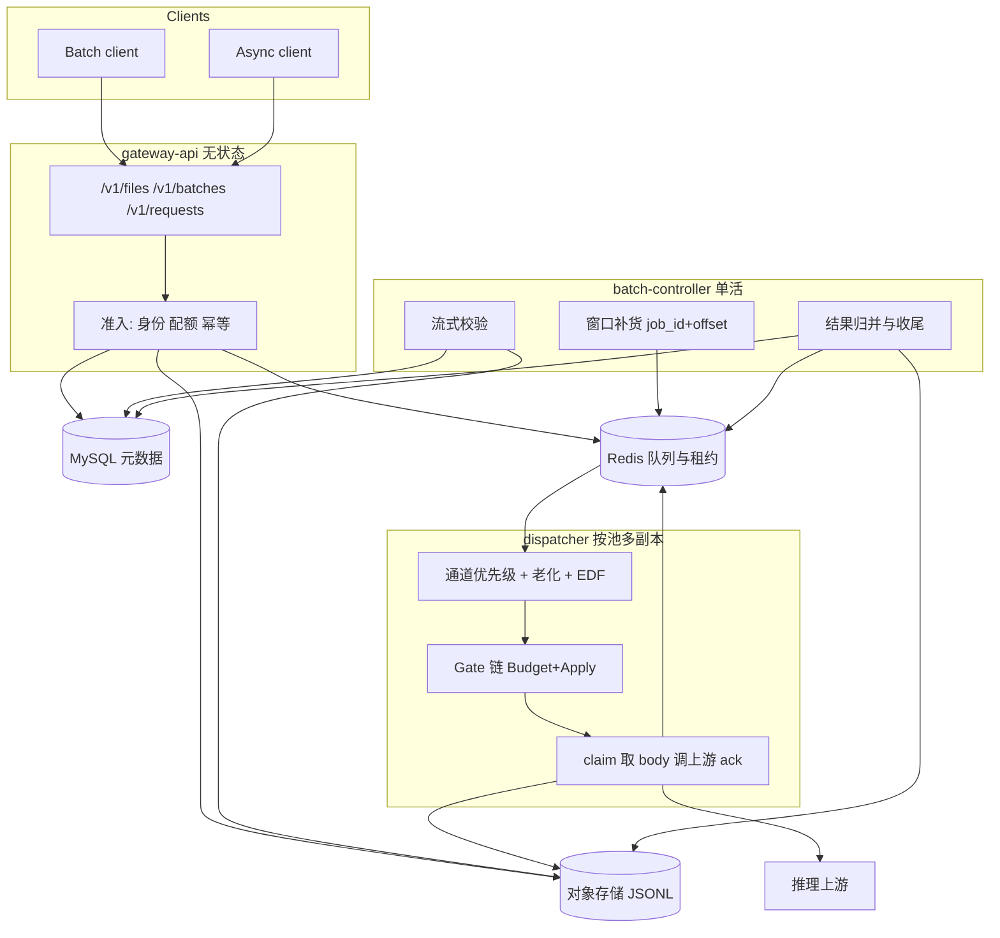

# RFC 0001：生产级异步 LLM 网关架构 / Production Architecture

| 项 | 内容 |
|---|---|
| 状态 | Proposed（已按评审意见修订，待复审） |
| 日期 | 2026-10-05 |
| 修订 | 2026-10-05：术语改为 async；元数据定为 MySQL 8；队列定为 Redis。队列消息、Gate、Flow 定义在本仓库 `internal/pipeline`，只在概念上对齐 llm-d-async，不导入、不锁定它的版本。 |
| 读者 | 本仓库负责人。批准本 RFC 之后才开始重构。 |
| 范围 | 仅架构决策。本 PR 不改应用代码。 |
| 基线代码 | 分支 `cursor/llm-async-gateway-demo-08d3`（demo 网关） |
| 背景材料 | 仓库调研笔记《统一近线与离线批量推理组件调研》。笔记里的上游版本只说明当时读过什么，不是本 RFC 的类型契约。 |

## 摘要

把 `llm-async-gateway` 从单进程演示收成公司内部自持的异步推理网关：对外继续提供 OpenAI Batch 兼容接口和 async 单请求接口，对内把两种入口收成带 `deadline` / `tier` / `tenant` 的请求单元，用可水平扩展的 gateway-api、dispatcher、batch-controller 去跑。

设计概念对齐 [llm-d-async](https://github.com/llm-d/llm-d-async) 与 [llm-d-batch-gateway](https://github.com/llm-d/llm-d-batch-gateway)（deadline 有序集合、claim/lease/ack、带 `Budget` 的 Gate、把组件串起来的 Flow、tier 通道、Batch 状态机）。队列消息、Gate 和 Flow 定义在本仓库的 `internal/pipeline`，字段和文档由我们维护。运行时代码、键空间、指标名和发布节奏保持自持，不导入上游 module，也不把它们的二进制嵌进生产路径。上游仍在快速变化；内部 SLO、存储和租户模型需要我们自己掌握。

本 RFC 批准的目标形态：

- **gateway-api**：无状态 HTTP。`/v1/files`、`/v1/batches`、`/v1/requests`。
- **batch-controller**：校验、按 `job_id + offset` 窗口补货、归并结果、推进状态机。单活。不用 coordinator 这个名字，理由见 3.1。
- **dispatcher**：按池水平扩展，内部是本仓库的 `pipeline.Flow`。通道优先级 + 通道内 EDF，claim/lease/ack，至少一次，带 fencing。
- **MySQL 8（InnoDB）**：作业、文件、async 请求、幂等键等元数据。与 Postgres 的取舍见 3.2。
- **对象存储**：输入 / 输出 / 错误 JSONL。
- **Redis（AOF + 副本，`noeviction`）**：队列、租约、重试停车、取消标记、配额计数、async 结果邮箱。不存文件字节。

### 术语

| 词 | 含义 |
|---|---|
| `tier` | 调度通道，只有 `interactive`、`async`、`batch`。它决定谁先被派发。客户端不能自己指定。 |
| `tenant` | 公司内部的调用方，一个团队或一个服务账号。身份由服务端从凭证解析，用来做隔离和配额。Phase 4 才强制认证。在那之前没有可信的 tenant。 |
| async | 单请求异步入口，就是 `POST /v1/requests`。demo 的代码和 README 里这条入口仍叫 Nearline（队列键 `q:nearline`）。本 RFC 一律写 async。Phase 1 把队列里的 tier 字符串改成 `async`。 |

## 1. 目标与非目标 / Goals and non-goals

### 1.1 目标

1. **生产可靠性。** 进程崩溃、单副本故障之后，已接受的请求不丢。投递语义是至少一次。结果写入幂等。过期与取消保留已完成的部分结果。
2. **生产性能。** 批量流量只填充在线推理的空闲容量。async 请求有 deadline，批量请求有 `completion_window`。调度、预算和扩容都围绕 deadline。
3. **两种入口、一个执行面。**
   - Batch：兼容 OpenAI Files + Batches 的作业语义（状态机、`custom_id`、`request_counts`、output/error JSONL、取消与过期的部分结果）。
   - async：单请求提交后立即返回 id，再轮询或取消。现有 `POST /v1/requests` 就是这条入口。
4. **概念对齐 llm-d，实现自持。** 队列消息、`Gate` 和 `Flow` 的形状参考它们的设计，类型写在本仓库。组件边界、存储布局和防饥饿策略按已经跑通的 demo 往下长。不把上游 dispatcher 二进制嵌进生产路径。
5. **可分阶段上线。** 每一阶段结束时，仓库仍是一个能跑通 async 与 batch 的网关，并带明确的退出标准。

### 1.2 非目标

- 替换公司现有的在线同步推理网关（llm-d-router / 其他 OpenAI 兼容入口）。在线流量的 TTFT/TPOT 由那一层负责。本网关只保证自己填进去的异步流量可被让路。
- 导入、锁定或 fork `llm-d-async`、`llm-d-batch-gateway` 的 module、进程或 Helm chart。它们的类型不是本仓库的定义。生产 dispatcher 和作业控制器都是我们自己的代码。
- 推理的恰好一次。GPU 上的重复执行用 fencing、`max_attempts` 和结果去重把成本圈住，不承诺恰好一次。
- 完整实现 OpenAI Responses 的 `background + stream` 断点续流，以及 Flex `service_tier` 的计费产品。
- 面向外部客户的计费平台、多云抽象、训练或微调作业。
- 把 demo 里已经写进 Redis 的数据在线迁到 MySQL。demo 数据视为可丢弃。生产切流发生在存储拆分完成之后。

### 1.3 已提议、需要评审人点头的决定

| ID | 决定 |
|---|---|
| D1 | 自持三进程（api / batch-controller / dispatcher），以及自持的 `internal/pipeline` 类型。不导入 llm-d 的 module，不运行它们的 dispatcher 二进制。 |
| D2 | 元数据进 MySQL 8（InnoDB），文件进对象存储，Redis 只放队列、租约和短 TTL 状态。 |
| D3 | 批量入队用本仓库的 `pipeline.Message`。body 引用放在 `Metadata` 的 `job_id` 与 offset 字段里，窗口补货；就绪队列里不放整段 body。 |
| D4 | 优先级通道为 `interactive`、`async`、`batch`。demo 队列里的字符串 `nearline` 在 Phase 1 改为 `async`。通道内按 deadline 做 EDF。保留 demo 的老化与最低份额。 |
| D5 | 可组合单位是本仓库的 `pipeline.Gate`：`Budget(ctx) float64` 加 `Apply`。用本仓库的 `ApplyChain` 串成本地并发 → 饱和度 → prometheus-budget → tier 准入。Phase 3 再按 token 计。未知 `gate_type` 启动失败（fail closed）。dispatcher 按本仓库的 `pipeline.Flow` 装配。 |
| D6 | 队列用 Redis，部署先用主从 + AOF。Lua 键从 Phase 1 起带 pool hash tag，避免以后为 Cluster 再改协议。 |

## 2. 现状评估 / Current state

本节只描述 `cursor/llm-async-gateway-demo-08d3` 上已经落地的行为。包布局与 HTTP 面以仓库 `README.md` 为准。

### 2.1 Demo 做对了、生产架构要保留的部分

这些是后续阶段的不变量。重构可以换进程和存储，不应把这些语义改丢。

**请求单元。** `model.Unit` 把 batch 的一行和 async 的一次提交收成同一条队列消息：`tier`、`deadline`（demo 里是 Unix 毫秒，同时是 sorted set 的 score）、`endpoint`、`body`、可选的 `batch_id` / `custom_id` / `line_index`。API 分开，执行面合一。这和调研笔记第 6 节的建议一致，而且已经有测试。生产队列改用本仓库的 `pipeline.Message`（deadline 为 Unix 秒），见 3.5。语义不变：一条消息就是一次推理。

**接口落在使用方。** `dispatch.Budget` 只有 `Allow(ctx, tier) (release, ok)`。`dispatch.Upstream` 只有 `Do(ctx, unit)`。现在的 `budget.Local` 是进程内令牌桶加 in-flight 上限，并为 batch 留 `RESERVED_BATCH_SLOTS`。dispatcher 循环不关心预算从哪来。

**Lua 把跨键更新收成原子操作。** 入队、claim、续租、重试停车、租约回收、重试提升、到期摘队、窗口补货、async 幂等创建、结果落盘，都在 `internal/store/scripts.go`。claim 是 `ZRANGE` + `ZREM` + 写入 `claimed`，member 为 `id|owner`，score 为租约到期时间。owner 每次 claim 新生成。续租脚本核对 member 仍在，旧 worker 续不上租。这就是 demo 版的 fencing。

**至少一次，结果幂等。** 租约默认 30s，每 `lease/3` 续期。dispatcher 崩溃后，过期租约会按原来的 deadline 回到就绪队列，不插队。终态用 `SET NX` 只记第一次；batch 行用 `HSETNX(custom_id)`，计数只加一次。`internal/retry` 对 408、429、5xx 和网络错误做指数退避，尊重 `Retry-After`，并压到剩余 deadline 的一半以内。另有 `MAX_ATTEMPTS`，避免毒请求一直打到 deadline。

**防饥饿。** `schedule.Pick` 默认 async 优先。demo 里这条通道的字符串是 `nearline`（`model.TierNearline`）。三条护栏：

1. batch 队头的 deadline 落在 `AGING_SLACK` 内，且早于 async 队头时，先处理 batch。async 自身更早或同样早时，async 仍赢。
2. 连续派发 `BATCH_RESERVE_EVERY` 个 async 之后，若 batch 队列非空，下一个名额给 batch。
3. 并发槽里留 `RESERVED_BATCH_SLOTS`，async 占不满。

这是相对 llm-d-async 六级严格优先级的有意差异。严格优先级在高峰期会把 batch 饿到 `expired`。纯 EDF 又会让一个快到期的大 batch 堵住 async。demo 的规则要留到生产。

**窗口补货，而不是整文件一次 `ZADD`。** `batch.Controller` 按作业 deadline 从早到晚补货。每个作业最多 `BATCH_ENQUEUE_WINDOW` 条未完成请求（排队 + 执行中），完成一条再补一条。补货与窗口判断在 `commitInputScript` 里原子完成。取消打作业级标记：未入队的行直接写成 `batch_cancelled`；已入队的在 claim 时跳过；执行中的请求在下一次租约心跳时中止上游。过期同样停止补货，未执行行写 `batch_expired`，已成功行留在输出里。

**OpenAI 作业面已经能演示。** 状态含 `validating`、`in_progress`、`finalizing`、`completed`、`failed`、`expired`、`cancelling`、`cancelled`。`completion_window` 用 Go duration，默认 `24h`，也接受 `30m`、`1h`。输出行用 `custom_id` 关联，不保证顺序。上游 `usage` 汇总进 batch 对象。async 的 `Idempotency-Key` 与创建记录在同一个 Lua 脚本里提交。

### 2.2 挡住生产的部分

| 缺口 | 代码里的事实 | 生产后果 |
|---|---|---|
| 单进程 | `internal/app` 把 HTTP、controller、dispatcher 放进同一个进程 | API 延迟和推理并发绑在一起。dispatcher 卡住或泄漏会带走提交与轮询。多副本时 controller 会重复推进同一作业。 |
| 文件与元数据全在 Redis | `filebody:*` 存原始字节；校验时整文件读进内存；unit 的 `Body` 是完整 JSON；输出行先堆在 hash 里，收尾再拼 JSONL | 撑不住 OpenAI 量级的 5 万行 / 200 MB。Redis 内存和 AOF 被冷数据占满。没有 `output_expires_after`，输出文件不回收。默认上传上限 10 MB。 |
| 预算按请求数，且只在进程内 | `budget.Local` 数的是 in-flight 个数和 RPS，不看 token | 长上下文把上游打满，闸门仍显示有余量。两个 dispatcher 副本各有一份桶，全局并发翻倍。`schedule` 的连续计数也是进程内的，多副本下最低份额只是近似。 |
| 不能进 Redis Cluster | `reclaimScript` / `promoteScript` 用 `ARGV` 拼队列键（`queuePrefix .. tier`），键不在 `KEYS` 里 | Cluster 会拒绝跨 slot 的脚本，或写到错误的 slot。单实例故障就是全站队列故障。 |
| 多租户是注释级的 | `metadata.tenant` 由客户端自己填。没有鉴权，不剥优先级头，没有配额，跨请求的读接口不按租户过滤 | 任何能打到端口的调用方都能提交、读取、取消。不能作为公司内部共享入口。 |
| 只有两条通道，且 body 仍在队列里 | tier 只有 `nearline`（本 RFC 称为 async）与 `batch`。窗口限制的是条数，每条仍携带完整 body | 没有 interactive 档来表达「必须让路」。窗口省掉了「一次性入队」的洪峰，没有省掉单条消息的体积。 |
| 结果 fencing 不完整 | 续租核对 owner；`finishScript` 以 `SET NX` 抢第一笔结果，写之前不再核对「这个 owner 仍持有租约」 | 租约过期后，旧 worker 和新 worker 可能都打到上游。第一笔写入获胜，第二笔 GPU 时间白费，且失败结果可能盖过随后的成功。 |
| 没有池 | 单一 `UPSTREAM_URL` | 多模型无法按 InferencePool 分片预算和队列。 |
| 没有可观测性 | 只有 slog。没有 Prometheus，没有 trace | 无法证明「批量没有把在线打坏」，也无法对 deadline miss 告警。 |
| 作业不能从字节偏移续跑 | 校验通过后，解析好的行整表放进 Redis list。controller 崩溃靠这张 list 接着补，不靠对象存储偏移 | 换存储之后如果仍把 plan 放在本地盘或 Redis，就重复了 llm-d-batch-gateway「换节点只能从头重试」的缺口。 |
| 取消比 OpenAI 更急 | 心跳发现取消标记后立刻中止上游 | 内部可以接受更快收口，但要做成可配置的排空上限，避免和「在途请求应完成」的调用方假设冲突。 |
| async API 还缺生产配套 | 有提交、轮询、取消、幂等键。没有 `wait`、没有 webhook、没有服务端打的公平性头 | 第一版生产可以继续轮询。长连接和回调单独排期，不塞进存储拆分。 |

`finalizing` 在 demo 里通常一闪而过：收尾在同一次 reconcile 里写完。生产上对象存储上传会把这个状态拉长，轮询必须能看见它。这是行为修正，不是新功能。

## 3. 目标架构 / Target architecture

### 3.1 进程



三个进程只通过 MySQL、对象存储和 Redis 协作，不互相 RPC。

**为什么叫 batch-controller，不叫 batch-coordinator。** 这个进程对作业做 reconcile：校验、按窗口补货、收结果、推进状态机。demo 里的类型就是 `batch.Controller`，生产沿用这个名字。coordinator 会和 llm-d-router 的 coordinator（`async-broker`，一条请求入口）撞名。本进程不接收客户端连接，也不是请求路由器。

| 进程 | 副本 | 职责 | 不做什么 |
|---|---|---|---|
| gateway-api | 水平扩展 | 鉴权、幂等、写元数据、流式收文件、读状态、读结果 | 不跑调度循环，不解析整批 JSONL |
| batch-controller | 单活（Redis 租约锁）。锁丢失后另一个副本接手 | 流式校验、维护入队游标、窗口补货、收结果、上传 output/error、推进状态机、GC | 不直接对客户端提供 HTTP |
| dispatcher | 每个 InferencePool 一组，组内多副本 | 选通道、要预算、claim、读 body、调上游、续租、ack 或停车重试 | 不改作业状态机，不拼最终 JSONL |

Controller 单活是为了作业状态机。Dispatcher 多副本是为了推理并发。API 多副本是为了提交和轮询。这三件事的故障域和扩容旋钮不同，所以要拆开。

Phase 1 就可以把二进制拆开。Phase 1 的系统记录仍可以是 Redis，以便这一阶段不引入新数据库。目标形态里的 MySQL 和对象存储在 Phase 2 到位。见第 6 节。

### 3.2 数据放哪

| 数据 | 存储 | 原因 |
|---|---|---|
| 文件与作业元数据、async 请求记录、幂等键、入队游标、审计所需的状态变迁 | MySQL 8（InnoDB） | 按租户、状态、时间查询；保留期按月而不是按 Redis 内存 |
| 输入 JSONL、output JSONL、error JSONL、可选的大体积 async 响应 | 对象存储（S3 兼容） | 体积大、可设生命周期，用来实现 `output_expires_after` |
| 就绪队列、claimed、retry、取消标记、controller 选主、共享 in-flight 计数、async 结果邮箱 | Redis | 需要 Lua 原子性和毫秒级更新。全部是热数据 |
| 逐行执行状态 | 不逐行写 MySQL | 5 万行高并发写关系库不划算。用 Redis 计数器 + 结果流 + 对象存储上的 checkpoint（已完成 `custom_id` 或行号区间） |

**MySQL 与 Postgres。** 这张元数据表只用事务、唯一约束、按列查询，外加一个 JSON 列存 OpenAI 的 `metadata`。这些 InnoDB 都有。不依赖 Postgres 才有的能力：用 `LISTEN/NOTIFY` 唤醒、用 advisory lock 做选主（选主在 Redis）、用 jsonb 路径索引当主查询。llm-d-batch-gateway 选 Postgres，是他们的部署选择，不是作业模型的要求。

因此元数据选定 **MySQL 8**。Phase 2 只写一种 SQL 方言，不同时维护 Postgres。以后若要换成 Postgres，换驱动和少量 SQL，不改进程划分和队列协议。

**队列选定 Redis。** 需要的是 sorted set、Lua 和 AOF。部署就是 Redis 主从：`appendfsync everysec` 或更严，至少一个同步副本，`maxmemory-policy noeviction`。内存满了就让写入失败，由 API 返回 503，不能静默淘汰队列。不把 Valkey 列为交付目标。

键从 Phase 1 起按池加 hash tag，例如 `lag:{pool}:q:async`、`lag:{pool}:claimed`。一个池的脚本只碰带同一 tag 的键。单机 Redis 下 hash tag 无行为差异；以后进 Cluster 时一个池一个 slot。`reclaim` / `promote` 里用字符串拼接出来的键，改成脚本的 `KEYS`。

async 小 body（阈值建议 32 KiB，可配置）放进 `pipeline.Message.Payload`，省一次对象存储读。超过阈值，或任何 batch 行，`Payload` 留空，引用放在 `Metadata` 里。

### 3.3 队列、优先级与 EDF

每个 InferencePool（通常对应一个基础模型或一条上游路由）一组键。池由服务端根据模型名映射，客户端不指定池。

通道，从高到低：

| 通道 | 含义 | 谁写入 |
|---|---|---|
| `interactive` | 必须让路的最高档。本网关默认不承接在线同步流量。通道先留给「极短 deadline 的内部异步」以及预算模型里的保留带 | 未来的短 deadline API，或显式配置 |
| `async` | `POST /v1/requests`。demo 队列里的字符串还是 `nearline` | gateway-api |
| `batch` | Batch 作业的行 | batch-controller |

Phase 4 再把每条通道乘上 `reserved` / `overflow`（租户配额内 / 配额外）。在那之前，调度只有上面三档，其中 `interactive` 可以没有流量，但 Budget 的基线要为它留空。

通道内 score = `pipeline.Message.Deadline`，Unix 秒，越小越先出队。同一秒内用请求 id 做稳定次序。demo 现在用毫秒；Phase 1 改成秒。秒级精度对 async 和 batch 足够，也让队列文档只有一种时间单位。

跨通道的选择保留 demo 的三条规则，并写成对三档都适用的形式：

1. 默认严格优先级：`interactive` > `async` > `batch`。
2. **老化。** 较低通道的队头 slack（`deadline - now`）小于 `AGING_SLACK`，且早于较高通道队头时，提升这一次 claim。较高通道自己更紧迫时不让。
3. **最低份额。** 每连续处理 N 个更高通道的请求，若较低通道非空，让出一个名额。`RESERVED_*_SLOTS` 继续留在并发闸里，避免高通道把 in-flight 打满。

多副本时，老化看的是队列头，天然全局有效。连续计数是进程内的，全局比例会有偏差；份额的硬保证以 Redis 里的共享槽位为准，不以进程内计数为准。

### 3.4 Claim / lease / ack

沿用 peek → claim → ack，不用 `ZPOPMIN`。

1. Lua 在就绪集合里取 score 最小且 `deadline > now` 的 member，移入 `claimed`，member = `id|request_token|owner`，score = 租约到期。
2. `RequestToken` 是 `pipeline.Request` 上的代次。每次进入就绪集合时新生成（首次入队、回收、重试提升各算一次）。ack 必须同时匹配 `RequestToken` 与 owner。
3. 心跳每 `lease/3` 续租。续租失败说明租约已被回收，worker 丢掉这次结果，不再写终态。
4. 成功、不可重试失败、取消、过期：在同一个脚本里，核对 fencing 通过后写结果、从 `claimed` 删除、更新计数。fencing 失败则只记日志，等合法持有者或回收逻辑处理。
5. 可重试失败：释放 claim，把原 deadline 放进 retry 集合，到期后再入就绪集合。retry 期间不占用预算槽。
6. 语义仍是至少一次。崩溃窗口内同一次推理可能打两次。幂等的是结果记录，不是 GPU。

取消标记按请求和按作业各一把。dispatcher 在 claim 之后、上游调用之前检查；执行中由续租心跳检查，并按配置的排空上限决定立刻中止还是等待在途完成。作业取消不扫描删除整个 sorted set。

### 3.5 窗口入队：`job_id + offset`

队列消息是本仓库的类型，放在 `internal/pipeline`。概念上接近 llm-d-async 的「一条带 deadline 的队列消息，再套一层内部信封」（代次、队列名、重试次数）。字段名、JSON 和注释以本节为准。不导入那个项目的 package，也不跟随它的某次发布。

```go
// internal/pipeline
package pipeline

// Tier 是调度通道。客户端不能填写。
type Tier string

const (
	TierInteractive Tier = "interactive"
	TierAsync       Tier = "async"
	TierBatch       Tier = "batch"
)

// Message 是一次推理。小 body 放在 Payload。
// batch 行和大 body 把 Payload 留空，位置写在 Metadata。
type Message struct {
	ID       string            `json:"id"`
	Created  int64             `json:"created"`  // Unix 秒
	Deadline int64             `json:"deadline"` // Unix 秒，同时是 sorted set 的 score
	Tier     Tier              `json:"tier"`
	Tenant   string            `json:"tenant,omitempty"` // 服务端写入
	Endpoint string            `json:"endpoint"`
	Payload  json.RawMessage   `json:"payload,omitempty"`
	Headers  map[string]string `json:"headers,omitempty"` // 服务端打标
	Metadata map[string]string `json:"metadata,omitempty"`
}

// Request 是入队之后的内部信封。RequestToken 是 fencing 代次。
type Request struct {
	Message      Message           `json:"message"`
	RequestToken string            `json:"request_token"`
	Queue        string            `json:"queue"`
	ResultQueue  string            `json:"result_queue,omitempty"`
	RetryCount   int               `json:"retry_count,omitempty"`
	Labels       map[string]string `json:"labels,omitempty"` // reserved / overflow，Phase 4
}

// Result 是一次推理的终态。HTTP API 再翻译成对外 JSON。
type Result struct {
	ID           string `json:"id"`
	RequestToken string `json:"request_token"`
	StatusCode   int    `json:"status_code,omitempty"`
	Payload      []byte `json:"payload,omitempty"`
	ErrorCode    string `json:"error_code,omitempty"`
	ErrorMessage string `json:"error_message,omitempty"`
}
```

`Metadata` 的键（值都是字符串）：

| 键 | 谁写 | 含义 |
|---|---|---|
| `job_id` | batch-controller | 所属作业 |
| `custom_id` | batch-controller | 输入行的 `custom_id` |
| `request_index` | batch-controller | 行号 |
| `payload_bucket`、`payload_key`、`payload_offset`、`payload_length` | batch-controller，或超阈值的 async | 对象存储上的 body 范围 |
| `traceparent` | gateway-api | 跨进程 trace |

生产者（API 或 controller）写 `Metadata`。dispatcher 不改这些键，也不接受客户端指定 `Tier` 或 `Tenant`。

Batch 行的 `Message`：

```json
{
  "id": "batch_req_…",
  "created": 1764044000,
  "deadline": 1764045130,
  "tier": "batch",
  "tenant": "team-a",
  "endpoint": "/v1/chat/completions",
  "metadata": {
    "job_id": "batch_…",
    "custom_id": "row-42",
    "request_index": "42",
    "payload_bucket": "lag-batch",
    "payload_key": "inputs/file_…",
    "payload_offset": "18432",
    "payload_length": "912"
  }
}
```

async 的小请求把推理 JSON 放在 `payload`，不带 `payload_*`。超过大小阈值时与 batch 一样改走 `Metadata` 引用。

发给上游之前，dispatcher 若看到 `payload_offset` 就按 range 读对象存储，用读到的 JSON 作为 HTTP body。上游看不到 `Metadata` 里的引用。

Controller 的做法：

1. 创建作业后状态为 `validating`。流式读对象存储，校验 `custom_id` 唯一、`method=POST`、`url` 与作业 `endpoint` 一致、单文件单模型。非法行把整批打成 `failed`，并带上 `errors`（与现在一致）。
2. 校验通过时把每行的 `offset/length/custom_id` 写成 plan（对象存储上的小清单，或 MySQL 上的游标加 plan 对象）。内存里不留全部 body。
3. 状态进入 `in_progress`。每个作业维持最多 `BATCH_ENQUEUE_WINDOW` 条未完成引用。游标存在 MySQL。补货按作业 deadline 排序。
4. Dispatcher claim 到引用之后再按 range 读 body。批量对这一次读取的延迟不敏感。
5. 进程在任意一点崩溃：游标之前的行已经入队或已经终态；游标之后的行还在 plan 里。重启后从游标继续。已完成的 `custom_id` 以 checkpoint 去重，不重复计入 `request_counts`。

窗口的代价与 demo 相同：跨作业 EDF 只在「已经入队的那一窗」里精确。更早的作业靠 controller 按 deadline 优先补货来近似。这是有意接受的权衡，用来换 Redis 内存有界和取消时不用扫全量消息。

async 不走窗口。API 在准入通过后直接把 `pipeline.Request` 写入 `async` 队列。

### 3.6 Gate 与 Flow

可组合的单位是本仓库 `internal/pipeline` 里的 `Gate`。`Budget` 是它的一个方法，用来表示还剩多少容量。这个拆法参考了 llm-d-async 里「闸门既报预算、又对单条请求做准入」的做法，接口本身由我们定义。

```go
type Verdict int

const (
    VerdictContinue Verdict = iota // 放行
    VerdictRefuse                  // 退回队列，不占着 worker
    VerdictWait                    // 停在内存里等。默认不用
    VerdictDrop                    // 直接终态，不再重试
)

type ReleaseFunc func()

type Gate interface {
    // Budget 返回 [0, 1]。0 表示没有余量，1 表示空闲。
    Budget(ctx context.Context) float64
    // Apply 对一条 Request 做准入。
    Apply(ctx context.Context, req *Request, releases *[]ReleaseFunc) (Verdict, error)
}

// ApplyChain 按顺序调用 gates。任一道不是 Continue 就停，并回滚这一轮拿到的 release。
func ApplyChain(ctx context.Context, req *Request, gates []Gate, releases *[]ReleaseFunc) (Verdict, error)
```

容量类闸门用 `Budget()` 表达剩余比例。准入类闸门（并发、配额、tier）在 `Apply` 里决定放行、退回或丢弃。

demo 里的 `dispatch.Budget.Allow` 到 Phase 1 就换成 `pipeline.Gate`。Phase 1 只实现本地并发这一道；饱和度、prometheus-budget 和 token 记账在 Phase 3 加进同一条 `ApplyChain`。

闸门按这个顺序叠，最终决定取最严的一个：

| 顺序 | 闸门 | 作用 | 失败时 |
|---|---|---|---|
| 1 | `local` | 进程内并发硬顶，防止单副本把上游打爆。Phase 1 同时有一把 Redis 共享计数，使多副本合计不超过配置值 | 拒绝，消息留在队列 |
| 2 | `saturation` | 饱和度 ≥ 阈值（默认 0.8）时，低通道不再取新请求 | 可配置。建议：读不到指标时 batch fail closed，async 维持上一笔有效值并告警 |
| 3 | `prometheus-budget` | `D ∈ [0,1]` 为剩余容量。仅当 `D > B_tier` 时放行。数量 `N = max_SYS × (D − B_tier)`，`max_SYS = ready_endpoints × max_concurrency` | 默认 fail closed |
| 4 | `tier-priority` | 饱和时高通道先拿 N。batch 被拒绝就留在队列里，不在 worker 内存里空转等待 | 拒绝 |
| 5 | `aimd` | 上游 429/503 乘性减，成功加性增，弥补 Prometheus 抓取滞后 | 与上面取更小值 |
| 6 | `leased-rate`（可选） | 外部规划器写入 `max_admission_rps` 和 `valid_until`。过期 fail closed | 过期则停 |
| 7 | `quota`（Phase 4） | 按租户的并发或速率。配额内标 `reserved`，超出标 `overflow` | 见第 4 阶段 |

每个 tier 一条基线。示意值，必须压测后再定：`B_interactive = 0`（本网关不主动占用）、`B_async = 0.05`、`B_batch = 0.20`。基线越大，越给在线突发留余量。

Phase 3 把「条数 N」换成「估算 token」：`Σ est_tokens ≤ token_capacity × (D − B_tier)`。估算先用字符近似（例如 `len/4`），调用方若已给出 `max_tokens` 则计入输出预留。精确 tokenizer 不是本阶段的退出条件。

未识别的闸门配置让进程启动失败。配错闸门不能变成不限流。

`Apply` 返回 `VerdictRefuse` 时不 claim，消息留在队列里。默认不用 `VerdictWait`：那会把 worker 停在内存里轮询闸门。已经 claim 的请求若在飞行中发现饱和，按重试路径停车，不丢弃。

**Flow。** dispatcher 进程实现本仓库的 `pipeline.Flow`，用来把组件串起来。Redis、MySQL、对象存储和 HTTP 在 `cmd` 里注入。加一种闸门或一种合并策略时，不改 claim/ack 循环。

```go
type Channel struct {
    Queue string
    Tier  Tier
    Gates []Gate
}

type MergePolicy interface {
    // 按优先级、老化和最低份额从多个通道里选出下一条。输出按推理池分开。
    Next(ctx context.Context, channels []Channel) (pool string, req *Request, ok bool)
}

type Flow interface {
    Channels() []Channel
    Merge() MergePolicy
    Results() <-chan Result
}
```

| 组成部分 | 我们的实现 | 可替换的部分 |
|---|---|---|
| `Channel` | 每个 tier 一条，上面挂一条 Gate 链 | 队列后端。v1 只有 Redis sorted set |
| `MergePolicy` | 优先级 + 老化 + 最低份额 | 合并策略本身。换实现时不改 worker |
| Worker pool | 一组 goroutine，上限由 Gate 给出 | 上游客户端（`Upstream`） |
| `Results` | 写出 `pipeline.Result` | 消费者。async 写 Redis 邮箱，batch 由 controller 收 |

`pipeline.Result.ErrorCode` 使用 demo 已经公开的小写错误码（`deadline_exceeded`、`cancelled`、`upstream_error`、`max_attempts_exceeded`）。`RequestToken` 用来去掉重复投递。HTTP 层把 `Result` 翻译成现有的对外 JSON。

### 3.7 async API 形态

生产第一版保持 demo 已经公开的形状，避免把同步 Responses 语义卷进来。

`POST /v1/requests` → **202**：

```json
{
  "endpoint": "/v1/chat/completions",
  "deadline_seconds": 300,
  "metadata": {"tenant": "demo"},
  "body": {
    "model": "mock",
    "messages": [{"role": "user", "content": "hello"}]
  }
}
```

- `endpoint` 默认 `/v1/chat/completions`，允许 `/v1/completions`、`/v1/embeddings`、`/v1/responses`。
- `deadline_seconds` 默认 5 分钟，范围 1 到 86400。内部 tier 固定为 `async`，客户端不能改。
- `Idempotency-Key` 在 TTL 内返回同一个请求。
- `GET /v1/requests/{id}` 返回同一对象。`status`：`queued`、`in_progress`、`cancelling`、`completed`、`failed`、`expired`、`cancelled`。
- 完成后 `response` 带上游 status code 和 body。失败时 `error.code` 使用现有集合：`deadline_exceeded`、`cancelled`、`upstream_error`、`max_attempts_exceeded`、`invalid_request`。
- `POST /v1/requests/{id}/cancel` 对未结束的请求写取消标记。已结束的请求原样返回。

Phase 4 之前，客户端写在 HTTP `metadata` 里的 tenant 不再作为身份来源。身份来自服务端认证。客户端自带的优先级、公平性、objective 头在转发给上游之前剥掉，由 dispatcher 按通道重写。队列消息上的 `metadata` 只放生产者自己的关联字段（`job_id`、`custom_id`、偏移、trace id）。

明确后做、不在 Phase 1–3 的 async 能力：

- `X-Async-Mode: wait`（或兼容 `X-AP-Mode: wait`）长连接，直到结果或 deadline。
- OpenAI Responses `background: true` 的 schema 适配层。
- Webhook。
- `service_tier: "flex"` 在容量不足时直接 429、不入队。

Batch HTTP 面保持现有路由：`/v1/files`、`/v1/batches` 的创建、查询、列表、取消。`completion_window` 继续接受 Go duration，文档写明这是相对 OpenAI「仅 `24h`」的扩展。补上 `output_expires_after`。列表按租户过滤放在 Phase 4；在那之前部署边界就是信任边界。

### 3.8 结果

- **async：** 终态是 `pipeline.Result`，写入 Redis 邮箱，TTL 沿用 `RESULT_TTL`（默认 48h）。超过大小阈值的 body 放对象存储，邮箱只留引用。`GET` 命中后可以把 TTL 缩短到一个宽限窗口（建议 60s，可配置）。
- **Batch：** dispatcher 把单行 `pipeline.Result` 写到该作业的结果流（Redis stream 或 list，带 `RequestToken`）。controller 单活消费，按 `custom_id` 去重，追加到对象存储上的 output/error 对象，更新 `request_counts` 和 `usage`。周期性 checkpoint。全部终态后进入 `finalizing`，上传完成再 `completed`。
- 输出行格式保持现在的 OpenAI 形状：`id`、`custom_id`、`response{status_code,request_id,body}`、`error`。
- 作业到期：停止补货，未执行行写 `batch_expired`，已成功行保留，作业状态 `expired`。
- 取消：状态先 `cancelling`，排空或中止在途（上限可配置，默认对齐 OpenAI 约 10 分钟，demo 的「下次心跳就中止」收成 `CANCEL_DRAIN=0s` 的兼容开关），然后 `cancelled`，并保留部分输出。

## 4. 概念映射 / Mapping to llm-d

图例：**采用** = 语义照搬，实现自写。**改造** = 取核心机制，边界或默认值按本仓库改。**分叉** = 明知上游那样做，我们选择另一条。

### 4.1 llm-d-async

| 上游概念 | 落到本仓库 | 决定 | 理由 |
|---|---|---|---|
| Async Processor 二进制 | `cmd/dispatcher` | 分叉 | 0.x 仍在改结果消息、指标名和头名。生产路径不嵌入上游进程。 |
| 队列消息 + 内部信封（deadline、payload、metadata、代次） | `internal/pipeline` 的 `Message` 与 `Request` | 改造 | 概念对齐。类型、字段名和 JSON 由本仓库定义，不导入上游 package。偏移放在 `Metadata`。 |
| Gate：`Budget` + 对单条请求的准入，以及闸门链 | `pipeline.Gate` 与 `ApplyChain` | 改造 | 同样的职责拆分。接口写在本仓库。demo 的 `Allow` 在 Phase 1 换成 `Gate`。 |
| 把队列、合并策略、worker、结果串起来的 Flow | `pipeline.Flow` | 改造 | 装配方式对齐。合并策略自写，因为要保留老化。Redis、MySQL、HTTP 在 `cmd` 注入。 |
| sorted set，score = deadline | `{prefix}:{pool}:q:{tier}`，score = `Message.Deadline` 的 Unix 秒 | 采用 | 同一秒用 id 排次序。 |
| `redis-pubsub` | 不引入 | 分叉 | 上游已弃用，且没有队列级闸门。 |
| Durable dequeue：peek → claim → ack，owner token | `claimed` member = `id\|RequestToken\|owner`，ack 前核对 | 改造 | 代次字段是我们的 `Request.RequestToken`。键名用 `lag:` 前缀。 |
| at-least-once，无 DLQ，以 deadline 终止 | 同样的投递语义，外加 `MAX_ATTEMPTS` | 改造 | deadline 不够挡住毒请求。超次数写 `max_attempts_exceeded`。 |
| Worker pool（处理器内部并发，不是 InferencePool） | Flow 里的 worker pool，上限由 Gate 给出 | 采用 | 并发 ≈ 吞吐 × 上游时延。 |
| 六级严格通道：tier × reserved/overflow | 三档 `interactive` / `async` / `batch`，Phase 4 再乘 reserved/overflow；加上老化与最低份额 | 改造 | 严格优先级会把 batch 饿到过期。demo 的护栏已经写明这个取舍。 |
| 通道名 async / interactive / batch | `pipeline.Tier`；demo 队列字符串 `nearline` | 改造 | HTTP 路径仍是 `/v1/requests`。Phase 1 把 tier 字符串改成 `async`。没有生产数据要迁。 |
| `prometheus-budget`：`N = max_SYS × (D − B)` | 一个 `Gate`，按 tier 不同的 B | 采用 | `Budget()` 返回剩余比例。指标名用我们自己的，查询语句按实际上游配置。 |
| `prometheus-saturation` | Gate 链的一层 | 采用 | 饱和时低通道让路。 |
| `local-max-concurrency` | 一个 Gate，外加 Redis 共享计数 | 改造 | 本地桶在多副本下会放大全局并发，必须加共享上限。 |
| `tier-priority-admission` | 饱和时的通道准入 | 采用 | 拒绝时留在队列里。 |
| 多道闸门取最严的一道 | `pipeline.ApplyChain` | 改造 | 链式组合的想法对齐。函数是我们的。 |
| `wait-on-refuse`（worker 内存里轮询闸门） | 不采用 | 分叉 | 闸门没开就不要 claim，worker 回去睡觉。避免占着 goroutine。 |
| 未知 `gate_type` 退化成恒开 | 启动失败 | 分叉 | 配错闸门不应变成不限流。 |
| `redis-leased-rate`，过期 fail closed | 可选闸门，Phase 3 之后 | 采用 | 给容量规划器留口，默认不启用。 |
| `redis-quota` | Phase 4 | 改造 | 配额内/外对应 reserved/overflow。计数可以在 Redis，账本在 MySQL。 |
| 带代次的结果投递 | 内部用 `pipeline.Result`，HTTP 层翻译成现有 JSON | 改造 | 结果类型自持。对外字段仍是 demo 已公开的形状。 |
| 指数退避 + `Retry-After` 钳制 | `internal/retry` | 采用 | 已实现。 |
| `x-llm-d-inference-objective`、fairness id、`slo-ttft-ms` | dispatcher 在确认上游版本之后再写 | 改造 | 上游头名有过 `x-gateway-*` 与 `x-llm-d-*` 的漂移。用配置锁定，不把客户端的头透传。 |
| `llm_d_async_*` 指标名 | `llm_async_gateway_*` | 分叉 | 自持看板。覆盖面见第 5.6 节，对齐的是「有哪些数」，不是字符串。 |
| 请求体变换插件（如 `gcs_uri_multipart`） | 不在范围内 | 分叉 | 内部上游是 OpenAI 兼容 JSON。 |
| Bring-your-own queue（含 GCP Pub/Sub） | 只支持 Redis | 分叉 | 公司内部一条队列协议就够。换 Kafka 需要另开 RFC。 |

### 4.2 llm-d-batch-gateway

| 上游概念 | 落到本仓库 | 决定 | 理由 |
|---|---|---|---|
| `/v1/files`、`/v1/batches` schema 与状态机 | `internal/api`、`model.Batch` | 采用 | demo 已覆盖状态、计数、`custom_id`、部分结果。 |
| apiserver / processor / gc 拆进程 | gateway-api、batch-controller、收尾与 GC 放在 controller | 采用 | 与第 3.1 节一致。 |
| Postgres 元数据 + 对象存储文件 + Redis 热状态 | Phase 2：对象存储 + Redis 热状态，元数据用 MySQL 8 | 改造 | 冷热分离采用他们的分法。关系库选定 MySQL，见 3.2。 |
| 作业级 Redis 优先级队列 | 不单独做。controller 按 MySQL 里的 `expires_at` 决定补哪个作业 | 分叉 | 请求级 EDF 已经在就绪集合里。再做一条作业 ZSET 会有两套排序。 |
| Ingestion 把输入下到本地盘，按 PrefixHash 排 plan | plan 是 `offset/length` 清单，放对象存储或 MySQL | 改造 | 本地盘换节点就丢，上游自己的 issue 也还在跟踪续跑。前缀亲和可以以后作为 plan 的排序键，不阻塞存储拆分。 |
| `dispatch_mode=sync` 的 AIMD 直发 | AIMD 只作为 Budget 的一层，没有第二条旁路 | 改造 | 所有推理都走队列。避免 sync/async 两套语义。 |
| `dispatch_mode=async` 时把完整 payload `ZADD` 进 llm-d-async | 窗口化的 `job_id+offset` | 分叉 | 200 MB 作业不应进 Redis。跨作业 EDF 在窗口内近似，用补货顺序补偿。 |
| 每副本一条结果队列 | 单活 controller 消费一条带 fencing 的结果流 | 改造 | 我们的 controller 是单活，不需要为了多 processor 副本把结果队列拆开。 |
| 过期、取消保留部分输出；未执行行写 `batch_expired` / `batch_cancelled` | 现有 controller 行为 | 采用 | 比「失败即丢掉已完成行」更符合 OpenAI，也符合上游的扩展。 |
| `completion_window` 接受任意 duration | 保持 | 采用 | OpenAI 文档目前只写 `24h`。内部需要 `1h` 这类短窗口。对外文档写清楚这是扩展。 |
| 崩溃后扫本地工作目录，不支持 checkpoint 续跑 | MySQL 游标 + 对象存储 checkpoint | 分叉 | 这是我们要补上的短板，也是自持的理由之一。 |
| 取消时如何从有序集合删掉未派发请求 | 作业级取消标记，claim 时惰性跳过 | 采用 | 上游文档里的第三种选项。demo 已经这样做。 |
| 认证交给 Kuadrant/Authorino，跨租户 404 | Phase 4 在本进程做 API key → tenant，跨租户 404 | 改造 | 内部系统先用简单凭证。租户隔离的语义采用，依赖的产品不绑定。 |
| 一次性入队以便全局 EDF 精确 | 窗口入队 | 分叉 | 见 D3。精确 EDF 的内存代价在内部批量规模下不划算。 |

### 4.3 有意不纳入本 RFC 的相邻系统

- llm-d-router 的 coordinator `async-broker`（`X-AP-Mode`）是另一条 async 入口。我们的客户端协议是 `/v1/requests`。以后若要兼容那个头，放在 API 适配层，不改队列。也因此本仓库的作业进程不叫 coordinator。 |
- EPP flow control 的内存队列是上游网关的「健康小缓冲」。持久队列留在我们的 Redis 里。本 RFC 不修改 EPP。
- vLLM `run-batch`、Ray Data、AIBrix 是离线执行器或另一套作业系统。我们的执行器是任何 OpenAI 兼容 HTTP 上游。

## 5. 可靠性与性能 / Reliability and performance

数字是草案，用来约束实现和压测，不是上线 SLO 的最终签字值。压测之后用一页附录修订，不回头改架构。

### 5.1 SLO 草案

| 对象 | 草案 | 说明 |
|---|---|---|
| gateway-api 可用性 | 月度 99.9% | 只计 API 进程和它依赖的 MySQL / Redis 可达。上游推理故障单列 |
| 接受后不丢 | 返回 202 或 batch 进入 `in_progress` 之后，单进程崩溃或 Redis 主从切换不丢请求 | 靠 AOF、副本和 ack fencing。切换窗口内允许重复执行 |
| async 时效 | 未超过配额且上游健康时，99% 的请求在自己的 deadline 内进入终态 | 默认 deadline 5 分钟。更短的 deadline 不单独承诺 |
| Batch 时效 | 在已规划容量下，99% 的作业在 `expires_at` 前进入终态 | 容量不足时的正确行为是 `expired` 加部分结果，而不是无限排队 |
| 重复执行 | 稳态（无崩溃、无超时）下，重复上游调用 < 0.1% 完成数 | 崩溃恢复允许每个过期租约多打一次 |
| 在线干扰 | 与在线共用一个池时，批量填充期间在线 TTFT p95 劣化不超过约定上限（建议先取 10%，待压测） | 测不到这条，就不能把 `B_batch` 放宽 |
| API 延迟 | `POST /v1/requests` 服务端时间 p99 < 50ms | 不含上游推理。文件上传按对象存储带宽另计 |

### 5.2 故障模式

| 故障 | 检测 | 行为 | 数据 |
|---|---|---|---|
| API 进程崩溃 | 负载均衡健康检查 | 其他副本继续。幂等键使客户端重试安全 | 已提交的事务还在 MySQL / Redis |
| Dispatcher 崩溃 | 租约到期 | 回收脚本把未完成请求按原 deadline 入队 | 可能重复推理一次。fencing 使旧进程的晚到 ack 无效 |
| Controller 崩溃 | 选主锁到期 | 新主从游标和 checkpoint 继续 | 不重复计 `request_counts` |
| Controller 脑裂 | 锁续租失败的一方必须停手 | 只有持锁者能补货和写最终对象 | 锁实现要用 fencing token，不能只用 `SETNX` 后无限干 |
| Redis 主库宕机 | 副本提升 | 队列暂停到提升完成。AOF 丢失的最后一秒可能回退 | 回退的请求由 controller 游标重新补货；async 由客户端凭幂等键重试 |
| Redis 内存打满 | `noeviction` 写入错误 | API 503，controller 停止补货 | 不淘汰已在队列里的请求 |
| MySQL 不可用 | API `/readyz` 失败 | 停止接受新作业和新的 async 请求。已在队列里的请求继续派发 | 进行中的作业状态延迟更新 |
| 对象存储不可用 | 读写错误 | 不能收新文件，不能收尾。已入队的引用派发失败则停车重试，直到 deadline | 不把半截输出标记成 `completed` |
| 上游 429/503 | HTTP 状态 | AIMD 这道 Gate 收紧；请求退避后重试 | 不把 429 记成作业失败 |
| 上游 4xx（请求错误） | HTTP 状态 | 不重试，写入错误终态 | 一行失败不失败整批 |
| 毒请求反复 5xx | `MAX_ATTEMPTS` | 终态 `max_attempts_exceeded` | 不再占用 GPU |
| 时钟偏移 | deadline 比较异常 | 所有进程用同一 NTP。score 用 Unix 秒。不在应用层「修正」时钟 | 偏移超过租约量级时会误过期，靠监控 `deadline_slack` |
| 取消与在途重叠 | 取消标记 + fencing | 未 claim 的跳过；在途的在排空上限内结束或中止 | 已成功的行保留 |
| 重复的 `Idempotency-Key` 配不同 body | 创建脚本 | 返回已存在的 id，不覆盖 body。文档要求调用方保证键与 body 一一对应 | 不定义「同键不同 body」的第二种资源 |

### 5.3 幂等

| 操作 | 键 | 行为 |
|---|---|---|
| 创建 async 请求 | `Idempotency-Key` | 已实现。生产上把记录放进 MySQL，TTL 内返回同一 id |
| 创建 batch | `Idempotency-Key`（Phase 2 补上） | 同一键返回同一 batch，不第二次入队 |
| 上传文件 | 新 id；可选内容哈希只用于审计 | 上传本身不覆盖 |
| 结果 | `(id, request_token)` 加 batch 的 `custom_id` | 只有持有当前 `request_token` 的 owner 能写。`custom_id` 在作业内唯一，计数只加一次 |
| 取消 | 请求 id / batch id | 对已终态的对象是空操作 |

### 5.4 背压

从外到内四层，每一层都在更早的地方把流量挡住：

1. **准入。** 文件大小、行数、每租户每模型已排队 token、创建速率。超限返回 429，不写队列。Phase 4 才有租户维；在那之前至少保留文件大小和全局排队上限。
2. **窗口。** 作业未完成引用达到 `BATCH_ENQUEUE_WINDOW` 就停止补货。Redis 里的 batch 消息数有上界。
3. **Gate。** `Apply` 不是 `Continue` 就不 claim。队列变长，API 不因此阻塞。
4. **上游。** 429/503 触发退避和 AIMD。若上游是 vLLM，它自己的 `max-num-queued-*` 是最后一道阀，本仓库不复制那套逻辑。

### 5.5 水平扩展

- API：无共享内存，副本数跟提交和轮询 QPS 走。
- Dispatcher：同一池的副本共享队列。claim 的 Lua 保证一条消息只有一个 owner。全局并发由 Redis 计数和 Prometheus 预算一起卡住，不由副本数乘以本地桶决定。
- Controller：一个活着的主。锁带 fencing token。不要为了吞吐把校验并行成多个主；真要并行时按 `batch_id` 哈希分片，每片仍是单主。默认不需要。
- Redis：主从 + AOF。队列按 pool 分键。一个池的热键是单线程的，池与池之间可以分到不同 slot 或不同实例。
- MySQL：主从。写路径是元数据和游标，不是逐 token。
- 对象存储：按文件横向扩展。
- 推理池：按模型扩容。信号用 backlog、deadline slack 直方图和上游饱和度。扩容动作（KEDA 或现有集群的控制器）不在本仓库里实现，本仓库只把信号做成指标。

### 5.6 可观测性

Phase 1 就要有这些指标，名字稳定，后面阶段只加标签。

| 指标 | 类型 | 标签 |
|---|---|---|
| `llm_async_gateway_queue_depth` | gauge | `pool`、`tier` |
| `llm_async_gateway_claimed` | gauge | `pool` |
| `llm_async_gateway_inflight` | gauge | `pool`、`tier` |
| `llm_async_gateway_dispatch_budget` | gauge | `pool`、`tier`、`gate` |
| `llm_async_gateway_gate_decisions_total` | counter | `pool`、`tier`、`gate`、`reason` |
| `llm_async_gateway_attempts_total` | counter | `pool`、`tier`、`result`（`ok`、`retry`、`expired`、`cancelled`、`failed`） |
| `llm_async_gateway_deadline_slack_seconds` | histogram | `pool`、`tier` |
| `llm_async_gateway_queue_wait_seconds` | histogram | `pool`、`tier` |
| `llm_async_gateway_upstream_seconds` | histogram | `pool`、`tier`、`code` |
| `llm_async_gateway_batch_jobs` | gauge | `status` |
| `llm_async_gateway_tokens_total` | counter | `pool`、`tier`、`direction`（`input` / `output`） |

Trace（W3C `traceparent` 放进 unit，跨进程不断）：

- `http.serve`（API）
- `batch.validate`、`batch.enqueue`、`batch.finalize`
- `dispatch.claim`、`dispatch.upstream`、`dispatch.ack`

日志继续用 slog，每条带 `request_id` 或 `batch_id`、`pool`、`owner`。

告警草案：API 可用性、Redis 拒绝写入、队列深度伴随 slack 接近 0、`expired` 比例、闸门指标源不可用、controller 无主。

## 6. 迁移计划 / Migration

每一阶段结束时，`make demo` 的路径（async 提交、batch 提交、取结果）仍然成立。不要求调用方一次改完。demo 的 Redis 数据不迁移。

### Phase 0 — 本 RFC

**内容。** 本文档。不改 `internal/` 与 `cmd/`。

**退出标准。** 第 8 节清单被仓库负责人批准。D1–D6 没有未关闭的反对意见。未决项留在第 7 节，不阻塞 Phase 1。

### Phase 1 — 拆进程 + 可观测性

**内容。**

- 三个二进制：`gateway-api`、`batch-controller`、`dispatcher`。`cmd/gateway` 可以变成分发入口或薄封装，避免 demo 脚本立刻作废。
- 在 `internal/pipeline` 落下第 3.5、3.6 节的类型。不新增对 llm-d module 的依赖，Go 版本保持仓库现有要求。
- 新入队的消息改为 `pipeline.Request`。deadline 与 sorted set score 改为 Unix 秒。
- Controller 用带 fencing token 的 Redis 锁选主。API 副本不再跑 reconcile。
- Dispatcher 按 `pipeline.Flow` 装配。Phase 1 的 Gate 仍是本地并发加 Redis 共享计数，接口已经是 `pipeline.Gate`。
- 队列键改为 `lag:{default}:q:async` 与 `lag:{default}:q:batch`。tier 字符串 `nearline` 改为 `async`。回收与提升脚本的键全部进入 `KEYS`。
- `/metrics` 与 trace，覆盖第 5.6 节里不依赖 MySQL 的那些。
- 文件和作业记录仍在 Redis。HTTP 路径与 JSON 字段保持兼容。

**退出标准。**

- Compose 或 e2e 能起 2 个 API、2 个 dispatcher、1 个 controller 主，并在主被杀掉后选出新主，作业最终完成且 `request_counts` 不双计。
- 两个 dispatcher 同时跑时，全局 in-flight 不超过配置值。
- 现有 `go test -race` 与一条跨进程的 async + batch 测试通过。
- Grafana 或纯 PromQL 能画出队列深度、in-flight、尝试结果、deadline slack。一条 trace 能从 `POST /v1/requests` 串到上游调用。

**这一阶段故意不做。** 对象存储、MySQL、Prometheus 饱和度 Gate、租户鉴权。

### Phase 2 — 存储拆分

**内容。**

- MySQL 存文件元数据、batch、async 请求记录、幂等键、入队游标。
- 对象存储存文件字节和 output/error JSONL。
- Redis 只留队列、claimed、retry、取消标记、锁、共享计数、async 邮箱。
- Batch 的 `pipeline.Message.Metadata` 带第 3.5 节的 offset 字段，`Payload` 为空。校验改为流式，plan 可在崩溃后续跑。
- 实现 `output_expires_after` 和 GC。
- Batch 创建补上 `Idempotency-Key`。
- 上传上限按 OpenAI 量级放开到 200 MB / 5 万行（可配置），CI 里用较小夹具证明流式与偏移读，不把 200 MB 当每次提交的负担。

**退出标准。**

- 一个大于 Redis 单值舒适区的夹具（至少数 MB、数千行）在上传后，Redis `INFO memory` 的增长与文件大小脱钩，只跟窗口里的引用数量相关。
- 杀掉 controller 再拉起，作业从游标继续，输出里没有重复 `custom_id`，状态最终正确。
- 现有 HTTP 示例（`examples/batch_input.jsonl`、`/v1/requests`）无需改字段即可跑通。
- 结果对象带生命周期；过期后 `GET` 内容返回明确的缺失，而不是静默空文件。

### Phase 3 — 可组合预算 + token

**内容。**

- 按第 3.6 节把 `local`、`saturation`、`prometheus-budget`、`tier-priority`、`aimd` 实现成 `pipeline.Gate`，用本仓库的 `ApplyChain` 串起来。未知 `gate_type` 启动失败。
- 每 tier 的基线可配置。`interactive` 通道存在于调度器里，即使没有生产者。
- 准入和预算按估算 token 记账。短请求和长请求在测试里消耗不同的预算。
- 模型到 pool、pool 到上游 URL 的静态映射。仍可以只配置一个 pool。

**退出标准。**

- 测试用的假指标源把饱和度拉高时，batch 的 `Apply` 返回 `Refuse` 且消息仍在队列里；async 在自己的基线下仍能派发。
- 假指标源不可用时，batch 闸门关闭（fail closed），进程不会当成「预算 = 1」。
- 一条估算 token 明显更大的请求比短请求更早打满预算（单测即可）。
- 写一份压测记录：在线 TTFT 在批量填充前后的变化，以及当时的 `B_batch`。记录可以是 `docs/` 下的短文，数字允许替换第 5.1 节的草案。

### Phase 4 — 多租户与配额

**内容。**

- API key（或公司现有的内部凭证）解析成 tenant。未认证请求 401。
- 去掉客户端 `metadata.tenant` 的信任。剥掉入站的优先级与公平性头，由 dispatcher 按通道和 tenant 重写。
- 配额：每租户每模型已排队 token、batch 创建速率、文件大小。超限 429，且 Redis 队列长度不增加。
- 配额分类 `reserved` / `overflow`，接入调度。
- 所有读取按租户过滤，跨租户返回 404。
- 若上游支持，附带 fairness id。头名字段做成配置。

**退出标准。**

- 两个租户的 e2e：互相看不见对方的 file、batch、request。
- 配额打满时 `POST` 返回 429，队列深度不变。
- 一个 reserved 租户的 async 请求，在 overflow batch 堆积时仍能在 deadline 内完成（用假上游和可控时钟的测试）。

### 阶段依赖

```text
Phase 0 RFC
   → Phase 1 进程与指标（仍是 Redis）
      → Phase 2 存储拆分（引用入队）
         → Phase 3 预算与 token（按池）
            → Phase 4 租户与配额
```

Phase 3 的假指标源不依赖 Phase 2 的对象存储，但按池分片的键布局在 Phase 1 就固定，避免预算阶段再搬一次队列。因此仍按上面的顺序做，不并行改同一批键。

## 7. 开放问题与风险 / Open questions and risks

未关闭的问题不阻止 Phase 1。阻止某个阶段的，写在该阶段的退出标准里。

| # | 问题 | 默认假设（若评审人不改） | 影响阶段 |
|---|---|---|---|
| Q1 | async 的承诺到底是「deadline 内完成」还是「尽力而为，过期就失败」？ | 两者同时成立：过期一定失败；容量内有第 5.1 节的 99% 目标 | 3、4 |
| Q2 | `completion_window` 短于 24h 是否要不同的调度权重？ | 不另做价格。更短的窗口只是更早的 deadline，EDF 自然优先 | 1 |
| Q3 | 预算信号用 EPP 队列、vLLM `num_requests_running`，还是两者级联？ | 先做可配置的 Prometheus 查询，默认级联：有 EPP flow-control 队列就用它，否则用 vLLM 运行中的请求数。指标名按部署填写 | 3 |
| Q4 | Redis 是否必须上 Cluster？ | 先主从 + AOF。键已经带 hash tag。Cluster 另开运维决策 | 1 |
| Q5 | 一个作业是否永远单模型？ | 是，与 OpenAI 一致。多模型由调用方拆作业 | 2 |
| Q6 | async 结果多大就落对象存储？ | 默认 256 KiB | 2 |
| Q7 | Checkpoint 的粒度？ | 每 N 行或每 T 秒写一次已完成行号区间，N 和 T 可配置。续跑不改变已写出的 JSONL 行内容 | 2 |
| Q8 | 内部是否要请求级账单？ | Phase 4 只保证 `usage` 汇总可靠。请求级账单另做，不在本 RFC | 4 |
| Q9 | 在线 TTFT 允许劣化多少？ | 草案 10%。Phase 3 压测可以改这个数，不改架构 | 3 |
| Q10 | 转发头用 `x-llm-d-*` 还是 `x-gateway-*`？ | 配置项，默认不发送，直到确认上游版本 | 3 |
| Q11 | `interactive` 通道何时有生产者？ | Phase 3 只把通道和基线做出来，没有新的 HTTP 路由 | 3 |
| Q12 | 要不要 `wait` 长连接？ | 不做，直到轮询成为实际负担 | 4 之后 |
| Q13 | 在线与批量是否分池？ | 默认一个池加预算让路。分池是部署选择，代码按 pool 键已经支持多池 | 3 |

风险：

1. **Prometheus 滞后造成过冲。** 缓解：AIMD 与预算取更严的值；batch fail closed。
2. **按请求数预算在 Phase 3 之前是错的。** Phase 1–2 用保守的 `MAX_CONCURRENCY` 硬顶顶着，不把 demo 的 RPS 数字当成生产容量。
3. **至少一次带来的重复 GPU 成本。** 缓解：`request_token` fencing、`MAX_ATTEMPTS`、结果去重。接受崩溃时多打一次。
4. **窗口使全局 EDF 变成近似。** 缓解：controller 按作业 deadline 补货；老化把快到期的 batch 抬上来。若压测显示大作业饿死小作业，先调窗口和补货排序，不回到全量入队。
5. **拆进程之后 controller 双主会双计。** Phase 1 的退出标准把这件事定成测试，而不是约定「只部署一个」。
6. **上游头名和指标名继续变。** 用配置隔离。不在代码里散落字面量。
7. **对象存储收尾失败把作业卡在 `finalizing`。** 必须可重入：已经上传的对象按 id 覆盖或续传，状态机允许从 `finalizing` 再入。

## 8. 评审清单 / Decision checklist

请仓库负责人逐项勾选。任一项「要求修改」时，在本文件对应章节改完再合并，不要带着口头例外进入 Phase 1。

### 批准即表示同意

- [ ] **D1** 自持 api / batch-controller / dispatcher 和 `internal/pipeline`。不导入 llm-d module，不运行它们的二进制。
- [ ] **D2** MySQL 8 放元数据，对象存储放文件，Redis（AOF + 副本 + `noeviction`）只放队列、租约和短 TTL 状态。
- [ ] **D3** 批量消息是 `pipeline.Message`，偏移在 `Metadata`，窗口补货。
- [ ] **D4** 通道为 `interactive` / `async` / `batch`，通道内 EDF，保留老化与最低份额。demo 的 `nearline` 改名为 `async`。
- [ ] **D5** 闸门是本仓库的 `pipeline.Gate`（`Budget` + `Apply`），用本仓库的 `ApplyChain` 组合。未知闸门 fail closed。Phase 3 按 token 计。dispatcher 是 `pipeline.Flow`。
- [ ] **D6** Phase 1 起键带 pool hash tag；集群形态先主从，不先上 Cluster。
- [ ] 第 2.1 节列出的 demo 不变量（单元模型、Lua 原子性、至少一次、防饥饿、窗口、OpenAI 状态机）在重构中保持。
- [ ] 第 6 节的阶段顺序和每阶段退出标准可以当作后续 PR 的完成定义。
- [ ] 第 5.1 节的数字是草案，允许在 Phase 3 压测后只改数字。

### 要求修改时请指出

- [ ] 目标架构（第 3 节）有无法接受的进程划分或存储选择。请写明替代方案。
- [ ] 映射表（第 4 节）里某条「分叉」应该改成「采用」，或相反。请指出行。
- [ ] 某个阶段太大，不能独立上线。请指出要拆开的退出标准。
- [ ] 第 7 节里有问题必须在 Phase 1 之前关闭。请指出编号。

批准人：________________  日期：________________

## 参考

- 本仓库 `README.md`：demo 的实际行为。
- 调研笔记：OpenAI Batch 语义、预算公式、durable dequeue、存储分工的背景。类型以本 RFC 第 3.5、3.6 节为准。
- OpenAI Batch 指南：<https://platform.openai.com/docs/guides/batch>
- 相关阅读（概念，不是本仓库的类型定义）：[llm-d-async](https://github.com/llm-d/llm-d-async)、[llm-d-batch-gateway](https://github.com/llm-d/llm-d-batch-gateway)。
